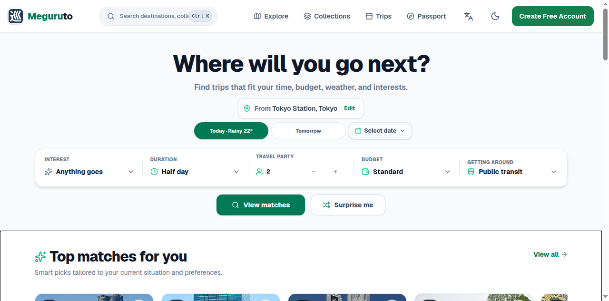
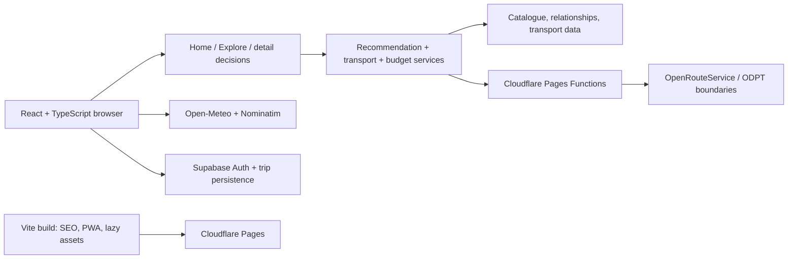

# Meguruto

**An origin-aware Japan travel decision engine for day trips and weekend getaways.**

Meguruto helps people choose a destination that fits their **origin, available time, transport, budget, season, and interests**—then inspect the travel trade-offs and turn a decision into a workable plan.

- **Live app:** [meguruto.app](https://meguruto.app)
- **Source:** [github.com/anee5h/trip-planner](https://github.com/anee5h/trip-planner)
- **Author:** [Aneesh Patil](https://anee5h.com)



> Screenshot captured on 2026-09-19 JST from a fresh public guest session on `meguruto.app`. It contains no account, email, token, private itinerary, or browser-debugging overlay.

## Why I built Meguruto

After moving to Japan, I found that planning a simple trip meant opening several sites at once: Google Maps for travel time, a weather forecast, fare calculators, travel blogs, and a notes app for comparing destinations.

There are plenty of lists of places to visit, but fewer tools that narrow the choice around a person's actual situation. Meguruto brings the destination decision into one place: start from where you are, describe the trip you can take, and inspect recommendations with their logistics, cost assumptions, and planning constraints.

## What the product does

A typical guest journey is:

1. **Choose an origin and trip duration.** The planner currently exposes short outing, half day, full day, `2d1n`, and `3d2n` options.
2. **Set transport, interests, party size, and budget.** Public transport and car modes are represented separately; other supported modes are selected only when the catalogue and transport boundary authorize them.
3. **Receive recommendations.** Home applies origin-aware feasibility and ranking; Explore provides browse, search, filter, sort, and map surfaces.
4. **Inspect a destination.** Detail pages show origin travel, transport evidence, destination information, seasonal context, and cost state.
5. **Generate a day plan or itinerary.** The planner can organize stops by date, reorder stops within a day, and save generated plans to an itinerary.
6. **Continue exploring or save places.** Collections, comparison, Passport, and Bucket List are available surfaces. Browsing and recommendations do not require an account; saving a Bucket List or syncing trips across devices enters the authenticated flow and presents a contextual signup/login prompt to guests.

Guest planning is intentionally useful before authentication. Authenticated users can persist profile preferences and trips through Supabase; browser-local itinerary grouping is kept separate from cross-device trip persistence.

## Engineering highlights

### 1. Origin-aware suitability and recommendation ranking

The recommendation pipeline separates **eligibility** from **preference scoring**:

- Eligibility removes visited records, unsupported or unauthorized transport modes, candidates that fail explicit day-trip duration constraints, and weekend candidates that fail the overnight policy.
- The scorer then combines catalogue ratings, budget fit, transport fit, interest/vibe signals, seasonal suitability, and environmental preferences. The live origin forecast is display context; it is deliberately not smuggled into destination ranking.
- The same origin-aware transport service feeds recommendation feasibility, cards, destination detail, roulette, budget, and planning instead of allowing each surface to invent its own travel-time interpretation.
- Recommendation diversity also avoids filling a rail with near-duplicate places from the same area or hub relationship.

Evidence: [`RecommendationPipeline.ts`](src/shared/services/recommendation/RecommendationPipeline.ts), [`RecommendationScorer.ts`](src/shared/services/recommendation/RecommendationScorer.ts), [`useTripRecommendations.ts`](src/features/home/hooks/useTripRecommendations.ts), and [`DestinationRelationshipService.ts`](src/shared/services/destination/DestinationRelationshipService.ts).

### 2. Multimodal transport with explicit uncertainty

The transport model represents train, shinkansen, bus, ferry, flight, rental car, and personal car. It distinguishes a routed or verified fact from a bounded estimate and from an unknown result.

- Transport topology authorizes which modes can be considered for an origin/destination zone pair.
- Curated ground, ferry, flight, and car-route facts can carry source URLs, fare scope, checked time, confidence, and completeness.
- A rough regional fallback is used only as a conservative decision bound; low-confidence rough travel is not ranked as though it were a routed journey.
- Car routing is isolated behind `POST /api/car-route`. The browser sends coordinates and target identity; the Pages Function validates the request, applies a rate limit, calls a fixed OpenRouteService endpoint, sanity-checks the response, and returns normalized route facts. The provider key remains server-side.

Meguruto does **not** claim nationwide, real-time timetable routing. The repository contains a bounded scheduled-transit capability with two registered static datasets—Sakata RunRun Bus and a Toei Oedo GTFS snapshot—and an ODPT API boundary/pilot. The ODPT direct-journey module explicitly records that it is capability work and is not called by the current production recommendation/planner path. Unsupported, unresolved, or incomplete coverage remains unavailable instead of becoming a fabricated route.

Evidence: [`TransportTopologyService.ts`](src/shared/services/transport/TransportTopologyService.ts), [`OriginAwareTransportService.ts`](src/shared/services/transport/OriginAwareTransportService.ts), [`ScheduledProductJourneyService.ts`](src/shared/services/transport/ScheduledProductJourneyService.ts), [`scheduledTransitDatasetRegistry.ts`](src/shared/services/transport/static/scheduledTransitDatasetRegistry.ts), [`car-route.js`](functions/api/car-route.js), [`odpt.js`](functions/api/odpt.js), and [`OdptDirectJourneyService.ts`](src/shared/services/transport/OdptDirectJourneyService.ts).

### 3. Cost estimation under incomplete data

The trip estimate engine is range-first. For a day trip it can combine origin travel, local transport, admission, and meals; an overnight estimate can add a party-total accommodation allowance. Shopping, souvenirs, optional activities, snacks, parking, and contingency uplifts are not silently folded into the total.

Each component carries semantic state and provenance, including:

- verified paid or verified free;
- documented model estimate;
- variable price;
- not applicable;
- unavailable, with a reason; and
- legacy/untrusted data that must not be presented as trustworthy.

A numeric range is not automatically a verified fare. An unknown value is not converted to zero, and a partial total remains visibly partial. This makes an approximate planning range useful without pretending that every ingredient is source-backed.

Evidence: [`tripEstimateEngine.ts`](src/shared/services/budget/tripEstimateEngine.ts), [`budgetState.ts`](src/shared/services/budget/budgetState.ts), [`budgetV2.ts`](src/shared/services/budget/budgetV2.ts), and [`factValidation.ts`](src/shared/services/budget/factValidation.ts).

### 4. Catalogue reliability as an engineering boundary

The current canonical catalogue contains **1,130 unique destination records** in [`destinations-index.json`](src/shared/data/destinations-index.json). This count is deliberately defined as records with unique canonical IDs; it is not a count of attractions, city hubs, collections, or generated pages. The live sitemap currently contains 1,133 URLs: the public hub paths plus one canonical destination page for each of those 1,130 records.

The catalogue is maintained as related generated inputs rather than one unvalidated blob:

- full and lite destination indexes support different loading needs;
- destination relationships and collection membership are checked against known IDs;
- read-only audits cover relationship integrity, geography signals, duration/timing completeness, naming, and generated-file consistency;
- the CI catalogue gate runs warning-baseline and generated-file sync checks when catalogue-affecting files change;
- SEO generation fails on incomplete canonical content and emits deterministic destination pages, sitemap data, and a public destination manifest.

Evidence: [`destinations-index.json`](src/shared/data/destinations-index.json), [`destinations-index.lite.json`](src/shared/data/destinations-index.lite.json), [`destination-relationships.json`](src/shared/data/destination-relationships.json), [`check-catalog-ci.ts`](scripts/check-catalog-ci.ts), [`audit-catalog-integrity.ts`](scripts/audit-catalog-integrity.ts), [`generate-seo-outputs.ts`](scripts/generate-seo-outputs.ts), and [`DestinationService.ts`](src/shared/services/destination/DestinationService.ts).

### 5. Bilingual, responsive, accessible journeys

The UI ships English and Japanese resources through `i18next`, with URL locale prefixes used for shareable and crawlable Japanese pages. Translation key and placeholder parity is checked in CI. The main recruiter flow has desktop and mobile Playwright coverage, an axe-based accessibility gate, and production-preview PWA tests.

The PWA boundary is intentionally described precisely: browser-emulated `display-mode: standalone` coverage and service-worker tests exist, but they do not establish physical installed iOS or Android behavior. That real-device validation remains open.

Evidence: [`src/i18n/index.ts`](src/i18n/index.ts), [`check-translation-parity.cjs`](scripts/check-translation-parity.cjs), [`playwright.config.ts`](playwright.config.ts), [`pr-checks.yml`](.github/workflows/pr-checks.yml), and the merged [KAI-297 recruiter QA report](qa/kai-297/recruiter-golden-path.md).

## Architecture

The browser owns the product experience and decision orchestration. Serverless functions are narrow provider and delivery boundaries, not a monolithic application backend.



- **Browser UI:** React and TypeScript routes in [`App.tsx`](src/App.tsx), feature modules for Home, Explore, destination detail, trips, collections, comparison, Passport, and auth.
- **Application decisions:** recommendation, transport, budget, season, relationship, and itinerary services under [`src/shared/services`](src/shared/services).
- **Catalogue and build assets:** committed JSON data, lazy full/detail loading, relationship indexes, deterministic SEO output, and PWA precache generation.
- **Deployment/serverless:** the live app is served through Cloudflare; `functions/` contains Pages Function boundaries for destination HTML, car routes, ODPT, feedback, errors, and protected QA surfaces. The committed [`wrangler.jsonc`](wrangler.jsonc) is explicitly a local test configuration, not a claim of production secret configuration.
- **Auth and persistence:** Supabase is optional for guest browsing and is used by authenticated flows for auth metadata and trip persistence. The recommendation engine does not execute inside Supabase.

## Verified stack

- **Frontend:** React `19.3.0`, TypeScript `7.0.2`, React Router `7.18.3`, Vite `8.3.0`, Tailwind CSS `4.3.3`, i18next `26.4.2`.
- **Deployment and serverless:** Cloudflare Pages, Pages Functions, service worker/PWA assets, Vite build-time SEO output.
- **Data and auth:** typed React services over committed JSON catalogue/relationship data, Supabase JS `2.115.0` for optional auth and authenticated trip persistence, browser storage for local itinerary state.
- **Integrations:** Open-Meteo forecasts, Nominatim origin lookup, fixed server-side OpenRouteService car routing, bounded ODPT/GTFS transport boundaries, and selected Wikipedia/editorial validation tooling.
- **Testing and quality:** Vitest `5.0.0`, Playwright `1.63.0`, `@axe-core/playwright`, Oxlint, ESLint, Prettier, TypeScript, catalogue validators, SEO/PWA/privacy checks, and GitHub Actions.

Versions above are read from [`package.json`](package.json); the live deployment may contain a different build until the corresponding source is deployed.

## Quality engineering

Quality gates are designed around the failure modes of a data-heavy, localized planning application rather than only component snapshots:

- **Unit and component tests:** Vitest covers recommendation, transport, budget semantics, itinerary logic, catalogue relationships, localization, and failure paths.
- **Browser journeys:** Playwright runs weighted file bins across Chromium desktop and mobile projects. The merged KAI-297 baseline covers the recruiter path through recommendations, destination detail, logistics/budget, itinerary generation, signup CTA, Explore, English/Japanese switching, fake-auth handoff, and browser-emulated standalone mode.
- **Accessibility and PWA:** dedicated axe-based desktop/mobile coverage and production-preview PWA/service-worker coverage.
- **Data and release gates:** TypeScript, lint, formatting, i18n parity, catalogue integrity/sync, SEO freshness, build, PWA, branding, protected-route, and secret/privacy scans.
- **Traceable QA evidence:** the [KAI-297 report](qa/kai-297/recruiter-golden-path.md) records the environment and limitations. Its 2026-09-19 snapshot reported 385 Vitest files with 5,319 passing tests and 2 skipped, 34 E2E specs assigned exactly once across four bins, 853 translation keys with no placeholder mismatches, and green exact-head PR checks. These are dated evidence snapshots, not permanent guarantees.

The scheduled `Full Remote Validation` workflow is manual/nightly by configuration; it is not described here as a passing pull-request check when it was skipped.

## Selected engineering challenges

### Conservative transport when regional evidence is incomplete

- **Problem:** a destination may have a known access mode but no trustworthy end-to-end journey, or only a rough regional distance estimate.
- **Approach:** centralize origin-aware evidence, use provider routes and curated corridors when available, label estimates, and use an upper-bound decision value for low-confidence rough transport.
- **Trade-off:** some recommendations and costs remain partial or unavailable. That is preferable to presenting a precise-looking number with no defensible route behind it.

### Budget truth when the source data is uneven

- **Problem:** admission prices can be missing, variable by date/product, or conceptually inapplicable to a city or open area.
- **Approach:** normalize value state, provenance, and reason code before consumers render or sort a cost; sum ranges only when the required ingredients are bounded.
- **Trade-off:** users sometimes see a partial range or “unavailable” component instead of a falsely complete total.

### A large catalogue without forcing every page to pay for every record

- **Problem:** discovery needs lightweight summaries, while detail and account flows need richer metadata and relationships.
- **Approach:** maintain full/lite indexes, lazy-load metadata and destination details, keep relationship indexes explicit, and generate SEO/PWA artifacts deterministically at build time.
- **Trade-off:** loaders and generated-file checks add operational complexity, but the data boundary is inspectable and failures are caught before release.

## Run locally

The repository uses **Node.js 22** in CI and **npm**.

```bash
git clone https://github.com/anee5h/trip-planner.git
cd trip-planner
npm ci
npm run dev
```

`npm run dev` copies the catalogue assets and starts Vite. Guest browsing and local UI work do not require production credentials. To exercise authenticated flows locally, copy [`.env.example`](.env.example) to `.env` and provide your own Supabase project URL and anon key. `.env` is gitignored; never commit credentials.

Useful verification commands:

```bash
npm run test:run
npm run test:e2e                 # install Chromium first: npx playwright install chromium
npm run test:pwa
npm run test:a11y
npm run validate:i18n
npm run check:catalog-ci
npm run build
npm run preview
```

For the repository's broad pull-request gate, run `npm run verify:pr`. Some transport-provider and authenticated paths require their documented environment or fixtures; provider credentials are never needed in source control or in the browser bundle.

## Limitations and next work

- Transport evidence is intentionally regional and mixed: routed facts, curated corridors, bounded estimates, and unknown states coexist. The ODPT/GTFS work is a limited pilot/static-artifact capability, not nationwide live timetable coverage.
- Approximate transport, admission, meal, and accommodation ranges are planning aids, not universally verified prices. Provider availability, seasonal operation, tolls, and product choices can change the result.
- Authenticated cross-device persistence requires Supabase configuration and an account; guest browsing is not blocked by login.
- Browser-emulated standalone mode and automated PWA tests do not replace physical iOS/Android installed-PWA validation.
- The catalogue is growing and still contains beta or estimated records. The app exposes provenance and unavailable states instead of hiding that unevenness.

The next useful improvements are deeper verified transport coverage, more source-backed cost facts, and physical-device PWA validation—not a claim that those gaps are already solved.

## Author

**Aneesh Patil — independent developer**

[anee5h.com](https://anee5h.com)
