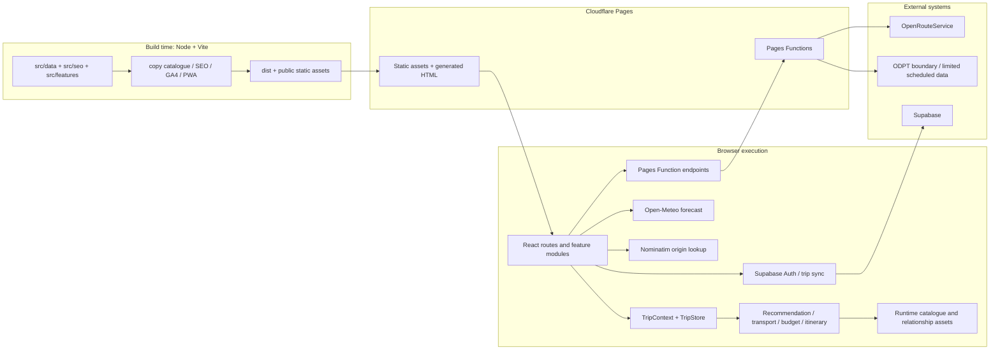
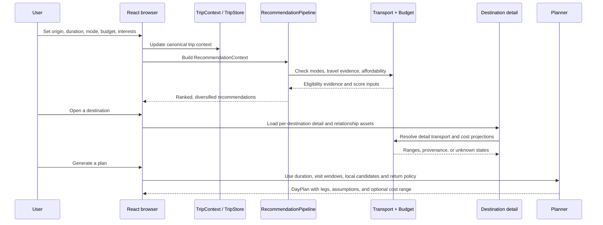

# Meguruto architecture

## Purpose

This document explains the runtime and build-time architecture that is actually present in Meguruto. It is a technical reference for the browser application, shared decision modules, catalogue assets, Cloudflare Pages/Functions, external providers, and Supabase. It intentionally does not replace the focused [recommendation engine](recommendation-engine.md), [transport estimation](transport-estimation.md), or [data-quality](data-quality.md) references.

## System overview

Meguruto is a client-heavy React/TypeScript application. Most destination decisions happen in shared browser modules that combine the current trip context with catalogue and transport evidence. Cloudflare Pages serves the build output and runs narrow Pages Functions for server-side provider, HTML-delivery, feedback, error, and protected-QA seams. Supabase is an optional authentication and persistence adapter; it is not the recommendation engine.

The main runtime layers are:

- **React application:** [`src/App.tsx`](../src/App.tsx) supplies the route tree, lazy route boundaries, shared providers, error boundary, locale URL handling, navigation, and account modal shell.
- **Decision modules:** recommendation, transport, budget, seasonality, relationships, and itinerary services under [`src/shared/services`](../src/shared/services). They return evidence-bearing results rather than raw provider payloads.
- **Catalogue:** canonical records in [`src/shared/data/destinations-index.json`](../src/shared/data/destinations-index.json), summary/full runtime assets, per-destination detail assets, and relationship projections.
- **External providers:** Open-Meteo for forecast display, Nominatim for origin lookup, server-side OpenRouteService for car routing, and a bounded ODPT/GTFS scheduled-transit capability. Each has a different seam and failure contract.
- **Persistence:** guest origin/compare/itinerary state uses browser storage where the relevant feature allows it; authenticated profile and trips use Supabase through [`useTripSync.ts`](../src/shared/hooks/useTripSync.ts) and [`TripRepository.ts`](../src/shared/services/trips/TripRepository.ts).
- **Build and delivery:** Vite builds the app, catalogue assets are copied into `public/data`, SEO pages and sitemap are generated into `dist`, and PWA assets are injected before Cloudflare Pages serves the result.

## System context

The diagram separates three execution contexts:

1. **Build time** creates deployable assets. It does not call recommendation services to rank a user request.
2. **Browser time** owns the interactive route and decision flow. It fetches catalogue assets and calls narrowly scoped external seams.
3. **Pages Function time** holds server-only provider credentials and performs validation/normalization for endpoints that must not expose those credentials to the browser.

The committed [`wrangler.jsonc`](../wrangler.jsonc) is explicitly a local test configuration. Production Pages project settings and secret values are deployment configuration and are not documented here.

## Representative request and decision flow

The context is not held in one global backend session. The browser keeps the active origin and planning state in React context/store; URL parameters carry relevant Explore/home state; guest origin and selected local state use browser storage; authenticated profile/trip synchronization uses Supabase. The exact persistence behavior is feature-specific, so a destination recommendation does not imply that the same state has already been persisted remotely.

Evidence: [`TripContext.tsx`](../src/shared/context/TripContext.tsx), [`useTripStore.tsx`](../src/shared/hooks/useTripStore.tsx), [`ItineraryGroupService.ts`](../src/shared/services/trips/ItineraryGroupService.ts), and [`TripRepository.ts`](../src/shared/services/trips/TripRepository.ts).

## Data architecture

| Data layer                | What it contains                                                                              | Runtime role                                                                                                                                                                |
| ------------------------- | --------------------------------------------------------------------------------------------- | --------------------------------------------------------------------------------------------------------------------------------------------------------------------------- |
| Full catalogue            | Complete destination records, cost facts, transport metadata, editorial fields                | Loaded asynchronously when a consumer genuinely needs full data; never treated as a summary record                                                                          |
| Lite catalogue            | Summary fields for list/search surfaces                                                       | Loaded as a separate runtime asset through [`PlaceCatalog.ts`](../src/shared/services/place/PlaceCatalog.ts)                                                                |
| Destination details       | One generated JSON record per destination                                                     | Detail route first fetches `/data/destinations/<id>.json`, then retries through the full index; a lite record is never presented as full detail                             |
| Relationship projection   | Compact hub/child/card/map nodes                                                              | Loaded by [`DestinationRelationshipService.ts`](../src/shared/services/destination/DestinationRelationshipService.ts); it is deliberately not the nationwide full catalogue |
| Static transport data     | Topology, ground/ferry/flight/car assumptions, and two registered scheduled-transit artifacts | Used only by the corresponding transport modules; scheduled data is hash- and coverage-validated before use                                                                 |
| Generated SEO assets      | Locale-specific prerendered destination pages, sitemap, and public destination manifest       | Build-time inputs for destination Pages Functions and crawlers; unknown IDs receive a real 404                                                                              |
| Runtime application state | Origin, active trip context, comparison, visited/favorites, planner state                     | React context/store plus browser storage and optional Supabase synchronization                                                                                              |
| Authenticated data        | Profile metadata and `trips` rows                                                             | Read/written through the Supabase adapter after a user session exists                                                                                                       |

The separation is deliberate. Summary data makes list surfaces independent from full-detail fields; detail files let a single destination fail or retry without making the entire index the only source; relationship projections avoid treating a card-oriented subset as the canonical catalogue; generated SEO assets make the public URL set deterministic; and user data remains separate from public catalogue data.

The runtime-lazy catalogue contract and retry behavior are documented in [`PlaceCatalog.ts`](../src/shared/services/place/PlaceCatalog.ts), [`useCatalogue.ts`](../src/shared/hooks/useCatalogue.ts), and [`DestinationService.ts`](../src/shared/services/destination/DestinationService.ts). The build copy step is [`copy-catalogue-assets.mjs`](../scripts/copy-catalogue-assets.mjs).

## External integrations and serverless seams

| Integration         | Browser request                                                       | Server-side boundary                                                                           | Actual result contract                                                                                                                                               |
| ------------------- | --------------------------------------------------------------------- | ---------------------------------------------------------------------------------------------- | -------------------------------------------------------------------------------------------------------------------------------------------------------------------- |
| Open-Meteo          | Forecast URL built from origin coordinates                            | None; fetched by browser weather modules                                                       | Forecast data is cached in memory for a short period; missing/invalid data becomes an error or an unknown/seasonal condition depending on the caller                 |
| Nominatim           | Postal-code lookup from the browser origin flow                       | None                                                                                           | A failed lookup does not create a guessed origin; the origin flow exposes unresolved/error handling                                                                  |
| OpenRouteService    | Browser calls `/api/car-route` with coordinates and target identity   | [`functions/api/car-route.js`](../functions/api/car-route.js)                                  | Request validation, rate limit, fixed provider URL, normalized route result; `no_route`, quota, provider, network, and missing-key states remain explicit            |
| ODPT                | Browser-side adapter calls `/api/odpt` with an allow-listed operation | [`functions/api/odpt.js`](../functions/api/odpt.js)                                            | Narrow validation, request identity, cache/dedup/budget protection, normalized `records`/`no_data`/`error` result; raw JSON-LD and credentials do not cross the seam |
| Supabase Auth/trips | Browser Supabase client when configured                               | Supabase itself; server Functions also use server-only keys for selected owner/admin endpoints | Auth session, profile metadata, and user-owned trips; missing configuration leaves guest browsing available                                                          |
| Feedback/errors     | Browser posts to `/api/feedback` or `/api/errors`                     | Pages Functions validate, rate-limit, redact/verify where applicable, and write to Supabase    | Storage failure is reported as an error; owner email notification is best effort and does not replace durable feedback storage                                       |

Detailed request and uncertainty behavior belongs in [`transport-estimation.md`](transport-estimation.md). Account deletion is a separate privileged endpoint with server-side recent-authentication checks in [`functions/api/account/delete.js`](../functions/api/account/delete.js).

## Deployment architecture

The `build` script in [`package.json`](../package.json) performs this sequence:

1. TypeScript/Vite build preparation.
2. Copy the canonical full/lite/relationship catalogue assets and gzip the Toei scheduled artifact through [`copy-catalogue-assets.mjs`](../scripts/copy-catalogue-assets.mjs).
3. Run Vite, including the static asset graph and manifest.
4. Generate locale-specific destination HTML, sitemap, and destination manifest through [`generate-seo-outputs.ts`](../scripts/generate-seo-outputs.ts).
5. Verify GA4 installation and inject PWA assets.

Cloudflare Pages serves the resulting static assets through its asset binding. Pages Functions add behavior where static delivery is insufficient:

- [`functions/[[path]].js`](../functions/[[path]].js) serves exact SPA shells or real 404s and applies noindex to private surfaces.
- [`functions/destinations/[id].js`](../functions/destinations/[id].js) and its Japanese adapter use the generated public manifest to serve prerendered destination HTML, fall back to the locale shell for a valid-but-missing prerender, and return a real 404 for an unknown ID.
- [`functions/e2e/[[path]].js`](../functions/e2e/[[path]].js) protects QA/Allure surfaces with a Cloudflare Access JWT and private R2 binding.
- API Functions hold provider and service credentials in Pages environment bindings. No values from those bindings belong in this repository or in the browser bundle.

Static responses receive headers from [`public/_headers`](../public/_headers). Function responses do not inherit that file automatically; the destination/catch-all handlers reapply [`SECURITY_HEADERS`](../src/seo/meta.ts). This is why static and Function header checks are both meaningful.

## Failure ownership

Failures are intentionally handled at the narrowest useful seam:

- **Catalogue asset failure:** `PlaceCatalog` clears the failed promise so a retry is possible; `useCatalogue` exposes `loading`, `error`, retained prior data, and `retry`.
- **Destination detail failure:** the per-record request falls back to the full catalogue; if both fail, the caller receives `null` rather than a lite record masquerading as complete data.
- **Provider failure:** Pages Functions return normalized error/no-route/not-configured states after validation; the browser does not parse provider-specific payloads as product truth.
- **Missing transport/cost evidence:** recommendation and budget layers retain, warn, downgrade confidence, or return unavailable according to the evidence contract. They do not manufacture a precise route or convert unknown cost to zero.
- **Unknown destination URL:** the destination Function returns a noindex 404; it does not serve an SPA soft-200 for an ID absent from the generated manifest.
- **Protected surface failure:** missing Cloudflare Access configuration fails closed for QA/Allure endpoints.
- **Supabase failure:** auth bootstrap stops loading honestly; trip/profile sync exposes an error status and reports the failure. Guest features do not depend on a valid Supabase client.

## Production, pilot, and incomplete boundaries

| Capability                                         | Current status                                                                                                                                               |
| -------------------------------------------------- | ------------------------------------------------------------------------------------------------------------------------------------------------------------ |
| React Home/Explore/detail/planner routes           | Implemented and exercised by browser/unit tests                                                                                                              |
| Origin-aware recommendation and range-first budget | Implemented in current product path                                                                                                                          |
| Car route provider                                 | Implemented server boundary; availability depends on deployment key/provider response                                                                        |
| ODPT API boundary                                  | Implemented and tested as a narrow normalized provider seam                                                                                                  |
| ODPT direct timetable Journey                      | Capability/pilot only; [`OdptDirectJourneyService.ts`](../src/shared/services/transport/OdptDirectJourneyService.ts) states that production does not call it |
| Static scheduled transit                           | Bounded registered artifacts with exact identities/temporal inputs; not nationwide routing                                                                   |
| Physical installed iOS/Android PWA                 | Not validated by the repository's browser-emulated tests                                                                                                     |
| Production Pages secret configuration              | External deployment configuration; values intentionally not documented                                                                                       |

## Relevant references

- [Recommendation engine](recommendation-engine.md)
- [Transport estimation](transport-estimation.md)
- [Data quality](data-quality.md)
- Existing ODPT constraints: [`docs/kai-290-odpt-timetable-pilot-constraints.md`](kai-290-odpt-timetable-pilot-constraints.md)
- Existing scheduled-transit boundary: [`docs/kai-292c2-production-transit-boundary.md`](kai-292c2-production-transit-boundary.md)
- Existing QA baseline: [`qa/kai-297/recruiter-golden-path.md`](../qa/kai-297/recruiter-golden-path.md)
