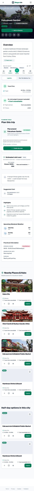
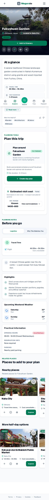
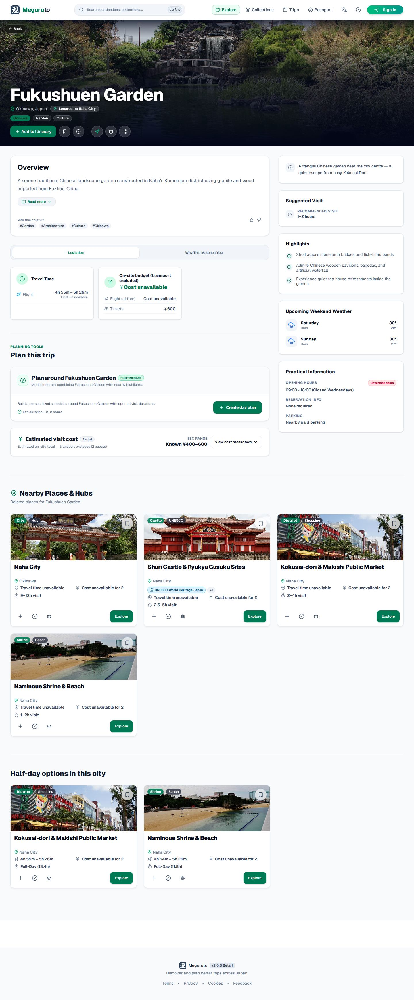
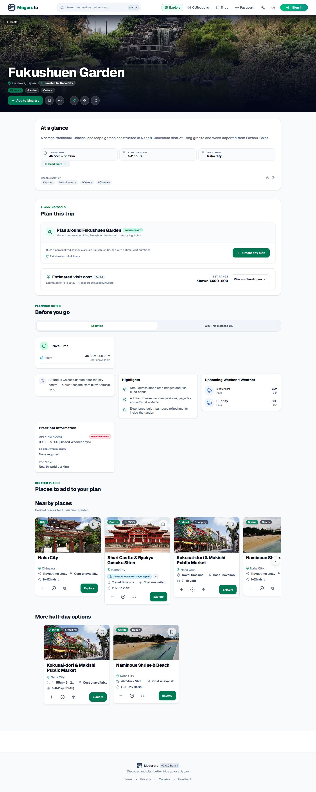
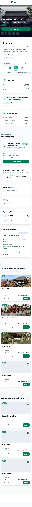
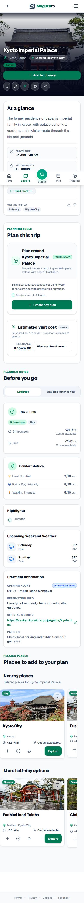
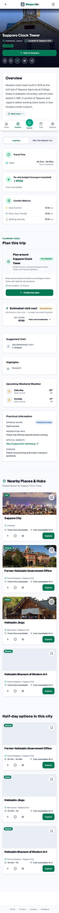
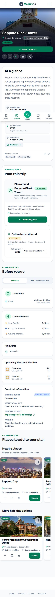
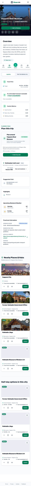
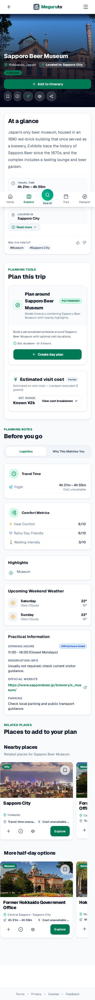

# KAI-211 destination detail QA

Captured against the branch build on 2026-08-29. The baseline images are from the synchronized mainline before the KAI-211 changes; after images are from the final branch build.

## Visual comparison

| Scenario | Before | After |
| --- | --- | --- |
| Paid admission, mobile 390px |  |  |
| Paid admission, desktop |  |  |
| Verified free, mobile 390px |  |  |
| Walking/access, mobile 390px |  |  |
| Partial local access, mobile 390px |  |  |

Representative routes:

- `fukushuen-garden-naha` — paid admission
- `kyoto-imperial-palace` — verified free
- `sapporo-clock-tower` — walking/access
- `sapporo-beer-museum` — partial local access

## Automated visual checks

- Viewports: 360px, 390px, 400px, and 430px; desktop 1440px.
- All four representative routes: document width stayed equal to viewport width; no page-level horizontal overflow.
- Related rails: `ScrollContainer` regions were present and programmatic horizontal movement was verified.
- Every representative route: one `trip-cost-breakdown`, one `destination-at-a-glance`, and no legacy `On-site budget (transport excluded)` block.
- English and Japanese destination-detail routes rendered without new English-label leakage in the Japanese flow.
