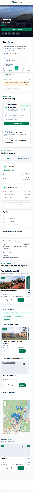
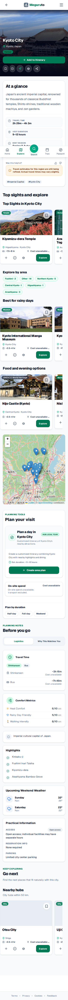
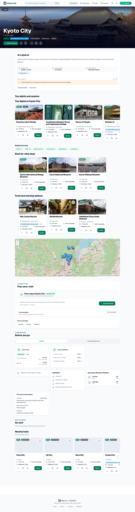

# KAI-212 hub hierarchy QA

Captured against the same production-preview harness before and after the KAI-212 change. The before capture is detached `origin/main` at `1affbde42224ca146b26dc3bbea525e3350f7388`; the after capture is the final KAI-212 working tree after the rich-hub bloat reduction.

## Routes and viewports

- Rich hub: `/destinations/kyoto-city`
- Sparse hub: `/destinations/koriyama-city`
- Partial hub: `/destinations/abashiri-city`
- Kyoto captured at 360, 390, 400, 430, and 1440px widths.
- Koriyama captured at 390 and 1440px widths.
- Abashiri captured at 390px width.

## Layout metrics

| Route / width | Before height | After height | Delta | Page overflow after | Final section order |
| --- | ---: | ---: | ---: | ---: | --- |
| Kyoto / 360 | 5843 | 5798 | -45 | 0px | top-sights → explore-rails → plan-your-visit → before-you-go → go-next |
| Kyoto / 390 | 5771 | 5726 | -45 | 0px | top-sights → explore-rails → plan-your-visit → before-you-go → go-next |
| Kyoto / 400 | 5847 | 5688 | -159 | 0px | top-sights → explore-rails → plan-your-visit → before-you-go → go-next |
| Kyoto / 430 | 5811 | 5688 | -123 | 0px | top-sights → explore-rails → plan-your-visit → before-you-go → go-next |
| Kyoto / 1440 | 5439 | 5418 | -21 | 0px | top-sights → explore-rails → plan-your-visit → before-you-go → go-next |
| Koriyama / 390 | 3528 | 3455 | -73 | 0px | plan-your-visit → before-you-go → go-next |
| Koriyama / 1440 | 3043 | 3041 | -2 | 0px | plan-your-visit → before-you-go → go-next |
| Abashiri / 390 | 3549 | 3386 | -163 | 0px | top-sights → plan-your-visit → before-you-go → go-next |

Kyoto discovery starts at 1100px and planning starts at 2920px at the 390px viewport. Every requested Kyoto mobile width is shorter than its pre-KAI-212 baseline; the largest mobile reduction is 159px at 400px. No captured browser page reported a page error or horizontal overflow.

## Screenshots

Representative before/after screenshots are tracked with this QA note and render directly in the PR:

| Before | After |
| --- | --- |
|  |  |
|  |  |

Additional final sparse/partial captures are available at `after/koriyama-city-390.png` and `after/abashiri-city-390.png`; the full machine-readable capture is `after-metrics.json`.

## Interaction checks

The focused KAI-212 E2E suite passed on Chromium mobile and desktop: 8/8 tests. It verifies mobile rail scrolling, desktop rail controls, hierarchy ordering, sparse and partial fallbacks, compact unavailable on-site spend with transport exclusion, no page-level overflow, and no new English heading leakage in JA. The evidence capture also passed 8/8 cases across all requested widths/routes with zero page errors.

Screen-reader AT was not run; this evidence is browser/DOM/visual QA only.
