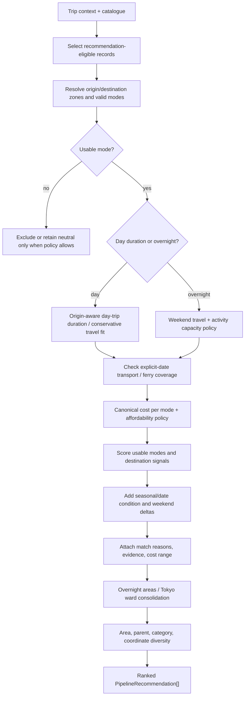

# Meguruto recommendation engine

## Purpose

This document explains how Meguruto selects, filters, scores, explains, and diversifies destinations. It describes the current implementation in [`RecommendationPipeline.ts`](../src/shared/services/recommendation/RecommendationPipeline.ts), [`RecommendationScorer.ts`](../src/shared/services/recommendation/RecommendationScorer.ts), and their callers. It does not claim that every collected preference is a ranking input, and it does not describe the engine as AI or as a learned model.

## Inputs

The browser builds a [`RecommendationContext`](../src/shared/services/recommendation/RecommendationContext.ts) from the active trip state. The important inputs are:

- **Origin:** home coordinates, and where resolved, origin prefecture, municipality, transport zone, and exact scheduled-transit product identity.
- **Trip duration:** `any`, short outing, half day, full day, or an overnight duration such as `2d1n`/`3d2n`.
- **Transport selection:** car mode (`none`, rental, or personal car) and selected public modes. The engine authorizes modes against topology and destination evidence rather than trusting static display fields alone.
- **Budget:** a numeric cap, budget tier, party size, and optional car-cost assumptions. The canonical cost engine is called per candidate/mode.
- **Interests/vibe:** values such as food, nature, history, art, sea, cool, and theme park. The legacy `tripType` field is still accepted as a compatibility alias.
- **Season and date:** explicit travel dates, duration-derived calendar days, destination seasonal evidence, and ferry temporal context.
- **Environmental preferences:** `preferred` weather preference (`any`, `rainy`, `hot`, or `cold`) and, when supplied by a caller, destination-specific weather context.
- **Visited and user feedback:** visited IDs are hard exclusions; thumbs-up/thumbs-down ratings and an optional user profile/personalization setting adjust scoring when present.

The engine also receives catalogue evidence: ratings, categories, tags, `recommendedVisitHours`, indoor percentage, relationships, transport metadata, and budget facts. A destination's raw `transportOptions` is not itself proof of an origin-aware journey.

### Inputs that do not automatically affect ranking

The application collects more context than every ranking path consumes. In the current Home hook, the live forecast is fetched for the selected origin and is used for calendar/display context; it is deliberately not passed as a destination forecast map to the recommendation context. A destination-coordinate forecast is a follow-up, not an implicit behavior. A preference can affect scoring only where `RecommendationScorer` reads it.

Evidence: [`useTripRecommendations.ts`](../src/features/home/hooks/useTripRecommendations.ts), [`RecommendationContext.ts`](../src/shared/services/recommendation/RecommendationContext.ts), and [`TravelConditions.ts`](../src/shared/services/recommendation/TravelConditions.ts).

## Eligibility versus scoring

Meguruto keeps several questions separate:

### Hard eligibility and feasibility

The pipeline first builds candidates from records with `recommendationEligible !== false`, removes visited IDs, resolves valid transport modes, and applies feasibility policies:

- an origin-aware request must have at least one authorized/usable mode;
- a constrained day trip must fit its selected duration envelope;
- an overnight request uses the weekend travel and activity-capacity policy;
- a ferry-only trip must be covered for every derived travel day and its return direction;
- candidates that are definitely over budget on every usable mode can be excluded, but a model/profile estimate alone is not strong enough to remove a destination;
- missing or unknown information is generally retained neutrally or retained with a warning rather than treated as a hard failure.

`getValidModes` is topology/evidence-aware. It does not turn a static mode flag into an origin-specific route. `TripDurationService` and `TravelConditions` supply shared feasibility semantics so Home and Explore do not maintain separate copies of the policy.

### Soft ranking preferences

Eligible candidates receive scores. Budget fit, transport fit, interest, seasonal suitability, environmental preference, user feedback, and optional profile personalization influence the ordering. A score is not a guarantee that a route or price is fully verified; the recommendation carries evidence and match reasons separately.

### Diversity and duplicate suppression

After scoring, the pipeline applies additional composition rules:

- `diversifyRecommendations` penalizes candidates that share an area, parent, leading category, or very close coordinates with already-selected results and avoids hub/child conflicts.
- Overnight results are consolidated into coherent areas/hubs before the final rail is returned.
- Tokyo ward results can be consolidated into a virtual group under the relevant origin policy.

This means the first result is not simply the highest raw numeric score for every record.

## Decision pipeline

The following is the current high-level order. It omits implementation-only object plumbing but preserves the meaningful gates and transformations.



The main implementation is [`runRecommendationPipeline`](../src/shared/services/recommendation/RecommendationPipeline.ts). Home calls it through [`RecommendationService.ts`](../src/shared/services/recommendation/RecommendationService.ts) and [`useTripRecommendations.ts`](../src/features/home/hooks/useTripRecommendations.ts). Explore scores records for sorting through `scoreForCatalog`, with its own browse filters and overnight policy.

## Scoring signals

The scorer's `SCORING_WEIGHTS` constant is the source of numeric weights. This document describes the signals conceptually rather than copying a second table of constants that could drift.

### Base and catalogue evidence

A base score starts the candidate. The destination's overall rating contributes through a reliability multiplier: high/medium/low rating metadata changes how much legacy rating-vector evidence can move the score. The separate KAI-89 rubric has verified, estimated, and unavailable states; an unavailable score is not silently replaced with a neutral quality claim.

### Mode and budget

For each valid mode, the scorer calls `calculateTripEstimate` and `evaluateAffordability`. A bounded estimate contributes budget fit or over-budget penalty; `may_exceed` remains mild/neutral because the range overlaps the cap. Transport contributes mode-specific signals when the estimate has the required evidence. Personal-car discovery does not receive a fabricated duration bonus from unproven catalogue values.

The best usable mode becomes the candidate's mode-specific score context. The separate pipeline budget gate decides whether the candidate remains eligible. Thus “ranked lower because of budget” and “removed because every source-backed mode is definitely over” are different outcomes.

### Interest and environmental preference

The `vibe` switch adds or subtracts interest-specific signals using categories, tags, and rating vectors. Day-trip environmental scoring reads actual destination weather only when the context supplies it, and applies indoor/outdoor and temperature signals. User preferences for rainy/hot/cold conditions use the same scorer paths. The selected origin's live forecast is not destination weather and is not treated as such.

### Seasonality

The scorer always adds a calendar-season signal from `destination.season[currentSeason]`, using a neutral fallback when the field is absent. This is distinct from live weather. Explicit travel-date conditions are handled by [`evaluateTravelConditions`](../src/shared/services/recommendation/TravelConditions.ts): forecast evidence can label a date, while missing forecast days use destination seasonal evidence or an explicit unknown reason. In the Home recommendation hook, the origin forecast is display-only, so destination-specific live weather should not be inferred from the origin card.

### Overnight scoring

`WeekendPolicy` separates travel bands, activity capacity, and weather. Ordinary local places are not overnight candidates unless the catalogue semantics mark them as overnight-worthy; longer trips can tolerate longer travel through policy softening. A candidate with unknown public-route minutes is not treated as a verified overnight fit. Personal-car-only unknown discovery can be retained under a ranking proxy, but the proxy is explicitly not a route fact and is not used as a budget or exact-feasibility claim.

## Origin-aware feasibility and duration

The origin determines more than a distance display:

1. `TransportTopologyService` resolves origin and destination zones and the modes that may connect them.
2. `OriginAwareTransportService` resolves a mode-specific estimate from exact municipality corridors, hub-access corridors, car provider routes, ferry/flight facts, or bounded fallbacks.
3. `TripDurationService` turns the estimate into a visit-plus-travel duration and applies conservative decision minutes for low-confidence rough estimates.
4. The pipeline applies explicit day-trip or overnight policy.

`recommendedVisitHours: { min, max }` is the canonical, origin-independent time spent at a destination. It must satisfy `0 < min <= max <= 48` for a destination that can be duration-planned. The deprecated optional `totalTripHours` field is not read by runtime planning and must not be populated for new records because legacy values may already include travel from an assumed origin.

Runtime total duration is derived per selected mode as:

```text
visit duration + round-trip origin-aware travel + legitimate buffers
```

When no origin is known, the total is the visit duration. When an origin is known but the selected mode has no usable travel evidence, constrained day-trip planning does not assign a fabricated duration. Duration-dependent meals, rental tiers, and budget ranges remain unavailable rather than treating unknown time as zero. Estimated travel is labelled as estimated and is never presented as verified.

For a day trip, a requested short outing/half day/full day applies an envelope only when the user selected a constrained duration. `any` remains a reachability/browse policy rather than an arbitrary duration rejection. For overnight durations, `WeekendPolicy` checks travel bands and available activity capacity instead of treating the day-trip envelope as a weekend rule.

The exact travel-time evidence model is documented in [`transport-estimation.md`](transport-estimation.md).

## Budget behavior

Budget affects both scoring and eligibility through the same range-first engine:

- each mode receives a trip estimate with component evidence;
- bounded complete/modelled totals can be compared to the cap;
- `fits` can add a budget benefit;
- `may_exceed` remains eligible and receives a warning/reason;
- `unknown` is neutral-retained;
- hard rejection requires every usable mode to be definitely over using sufficiently strong source-backed evidence.

The engine includes origin travel when coordinates exist, local transport, admission, meals, and accommodation for overnight durations. It does not convert an unavailable component to zero. See [`tripEstimateEngine.ts`](../src/shared/services/budget/tripEstimateEngine.ts), [`budgetState.ts`](../src/shared/services/budget/budgetState.ts), and [`RecommendationExplainability.ts`](../src/shared/services/recommendation/RecommendationExplainability.ts).

## Unknown information

Unknowns are typed outcomes rather than silent defaults:

- no origin or unresolved zone can produce no origin-aware estimate;
- low-confidence regional time can be retained only under conservative decision semantics;
- missing fares can leave transport cost unknown while duration remains usable;
- missing admission evidence can be unavailable, not applicable, legacy/untrusted, or a labelled model estimate depending on the record;
- missing forecast and seasonal evidence produces an explicit unknown condition with no fabricated score delta.

A candidate can therefore be visible while carrying a partial cost, an unknown fare, or a warning. The UI's “unknown” state is not equivalent to free, zero minutes, or verified suitability.

## Illustrative walkthrough

The following is an **illustrative context**, not a live provider result:

- origin: a user-selected station whose coordinates resolve to a known mainland transport zone;
- duration: `2d1n`;
- selected mode: train;
- party: two people;
- budget cap: `¥30,000` total;
- interest: history;
- date: a user-selected autumn date.

For a hypothetical historical destination record:

1. The candidate is removed if it is marked non-recommendation-eligible or already visited.
2. Train is retained only if topology and origin-aware transport evidence authorize it. A static destination `transportOptions.train` value alone is insufficient.
3. `WeekendPolicy` checks the travel band and whether the destination/child POI set supplies enough activity capacity for `2d1n`.
4. The budget engine builds a range from transport, admission, meals, and one accommodation night. If the range overlaps `¥30,000`, the destination remains eligible with a “may exceed” explanation; if admission is unavailable, the result remains partial/unknown rather than zero.
5. The scorer adds the history signal, calendar-season evidence, mode/budget terms, and any applicable user feedback. It does not treat the origin's forecast as destination weather.
6. The result receives match reasons and evidence, then participates in overnight-area consolidation and diversity suppression.

The example demonstrates control flow only. It does not assert that a particular destination has a particular train time, fare, or autumn score.

## Relevant source and tests

- Pipeline: [`RecommendationPipeline.ts`](../src/shared/services/recommendation/RecommendationPipeline.ts)
- Scoring: [`RecommendationScorer.ts`](../src/shared/services/recommendation/RecommendationScorer.ts)
- Context: [`RecommendationContext.ts`](../src/shared/services/recommendation/RecommendationContext.ts)
- Duration/date policy: [`TripDurationService.ts`](../src/shared/services/recommendation/TripDurationService.ts), [`TravelConditions.ts`](../src/shared/services/recommendation/TravelConditions.ts), [`WeekendPolicy.ts`](../src/shared/services/recommendation/WeekendPolicy.ts)
- Explainability: [`RecommendationExplainability.ts`](../src/shared/services/recommendation/RecommendationExplainability.ts)
- Callers: [`useTripRecommendations.ts`](../src/features/home/hooks/useTripRecommendations.ts), [`Destinations.tsx`](../src/features/destinations/Destinations.tsx)
- Tests: [`RecommendationPipeline.test.ts`](../src/shared/services/recommendation/RecommendationPipeline.test.ts), [`RecommendationService.test.ts`](../src/shared/services/recommendation/RecommendationService.test.ts), [`TripDurationService.test.ts`](../src/shared/services/recommendation/TripDurationService.test.ts), and relevant Explore tests under [`src/features/destinations/__tests__`](../src/features/destinations/__tests__).

## Limitations

- The ranking formula is deterministic and catalogue-driven; it is not trained from user outcomes.
- Destination-coordinate live weather is not a general Home ranking input.
- A route or fare may be regional, corridor-only, estimated, or unavailable. The engine does not turn the current catalogue into universal door-to-door routing.
- Personalization is optional and profile-dependent; the base guest path remains deterministic for its supplied context.
- A high score is a suitability/ranking result, not proof that every underlying fact is verified.
