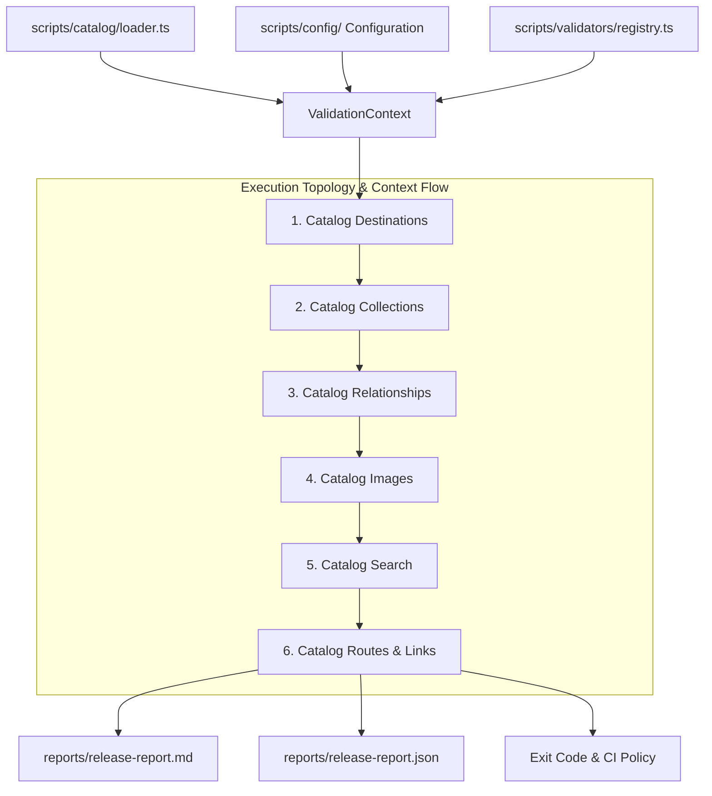

# Specification & Design Document: TabiMap Catalog Quality Assurance Framework (v1.6.0)

This design specification outlines the architecture, components, contracts, and 10-step incremental implementation plan for the **TabiMap Catalog Quality Assurance Framework**.

---

## 🏛️ Executive Architecture & System Topology

The TabiMap Catalog Quality Assurance Framework is a modular, configuration-driven, Context-based validation subsystem (`QA_FRAMEWORK_VERSION = "1.0"`) designed to enforce data integrity across all travel hub and attraction POI destinations, images, collections, relationships, search indexes, and application routes.



---

## 🏗️ Core Contracts & Interfaces (`scripts/validators/types.ts`)

```typescript
export const QA_FRAMEWORK_VERSION = "1.0.0";

export type Severity = "info" | "warning" | "error";

export interface ValidationIssue {
  severity: Severity;
  code: string;
  message: string;
  targetId?: string;
}

export interface ValidationResult {
  name: string;
  passed: boolean;
  issues: ValidationIssue[];
  metrics: {
    totalChecked: number;
    errorsCount: number;
    warningsCount: number;
    infoCount: number;
  };
}

export interface ValidationContext {
  catalog: {
    destinations: any[];
    collections: any[];
  };
  config: any;
}

export interface ValidatorModule {
  name: string;
  description: string;
  dependsOn?: string[];
  purpose: string;
  guarantees: string[];
  doesNotValidate: string[];
  validate(context: ValidationContext): Promise<ValidationResult>;
}

export interface ReleaseReportMetadata {
  version: string;
  qaFrameworkVersion: string;
  gitCommit: string;
  generatedAt: string;
  validators: ValidationResult[];
}
```

---

## ⚙️ Shared Catalog Loader (`scripts/catalog/loader.ts`)

To prevent duplicate file I/O and ensure all validators inspect an identical in-memory snapshot:

```typescript
export async function loadCatalog() {
  // Read destinations-index.json and collections-index.json once
  return { destinations, collections };
}
```

---

## 🚦 CI Exit Code & Execution Policy

| Result                              | CI Status                    | Behavior                                          |
| :---------------------------------- | :--------------------------- | :------------------------------------------------ |
| **Errors (`errorsCount > 0`)**      | ❌ **Fail Pipeline**         | Returns Exit Code `1`                             |
| **Warnings (`warningsCount > 50`)** | ✅ **Pass with Annotations** | Returns Exit Code `0` with PR summary annotations |
| **Info (`infoCount >= 0`)**         | ✅ **Pass**                  | Logged to QA report                               |

---

## 📋 Incremental 10-Step Implementation Roadmap

1. **Step 1: Shared Catalog Loader (`scripts/catalog/loader.ts`)**
2. **Step 2: Destination Validator (`scripts/validators/destinations.ts`)**
3. **Step 3: Collection Validator (`scripts/validators/collections.ts`)**
4. **Step 4: Relationship Validator (`scripts/validators/relationships.ts`)**
5. **Step 5: Image Validator (`scripts/validators/images.ts`)**
6. **Step 6: Search Validator (`scripts/validators/search.ts`)**
7. **Step 7: Route & Link Validator (`scripts/validators/links.ts`)**
8. **Step 8: Unified Runner & CLI Entry Points (`scripts/validate-all.ts` & `scripts/cli/*.ts`)**
9. **Step 9: CI Integration (`.github/workflows/validate.yml`)**
10. **Step 10: Catalog Validation Sweep & Report Generation (`reports/release-report.md` & `.json`)**

---

> [!NOTE]
> Per workflow directive: No `git commit` or `git push` will be executed until explicitly requested.
