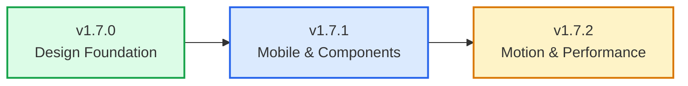

# TabiMap v1.7.x — Implementation Plan (Final)

**Theme:** _From Feature Complete → Premium Experience_

**Goal:** Execute the v1.7.0 roadmap across **3 incremental milestones** — each independently reviewable and deployable — removing all "indie/prototype" rough edges through systematic UX polish, visual hierarchy improvements, component consistency, and performance optimizations.

---

## Revision History

| Version       | Key Changes                                                                                                                                                                                                               |
| ------------- | ------------------------------------------------------------------------------------------------------------------------------------------------------------------------------------------------------------------------- |
| v1            | Initial plan — single release, 65–85 files                                                                                                                                                                                |
| v2            | Split into 3 milestones, removed DesignSystem.ts, ScrollContainer over MoreMenu, audit-spacing script, centralized motion.ts, removed floating CTA                                                                        |
| **v3 (this)** | PR-level splits within milestones, safe spacing migration via new `base` token, formalized duration tiers, LazyImage `sizes`, probability-classified prefetching, visual regression checklist, softened Lighthouse target |

---

## Milestone Overview



| Milestone  | PRs                                                  | Scope                                             | Est. Files |
| ---------- | ---------------------------------------------------- | ------------------------------------------------- | ---------- |
| **v1.7.0** | PR 1: Tokens — PR 2: PageHeader                      | Design system, spacing, typography, PageHeader    | ~30–35     |
| **v1.7.1** | PR 3: Mobile — PR 4: Components — PR 5: Nav & Polish | Drawer, scroll, pills, cards, navigation, polish  | ~35–40     |
| **v1.7.2** | PR 6: Motion — PR 7: Performance                     | Animations, lazy images, skeletons, prefetch, CLS | ~25–30     |

---

# Milestone 1: v1.7.0 — Design Foundation

---

## PR 1 — Spacing, Typography, Colors

_Global token changes. Intentionally isolated so regressions are easy to trace._

---

### Spacing Migration (Safe Approach)

> [!IMPORTANT]
> Instead of overwriting `md: 12px → 16px` (which silently changes meaning for existing consumers), introduce a new `base: 16px` token and deprecate `md`. This avoids silent regressions.

#### [MODIFY] [design-tokens.ts](file:///home/aneesh/Desktop/projects/trip/src/shared/theme/design-tokens.ts)

```diff
 export const designTokens = {
   spacing: {
     xs: "4px",
     sm: "8px",
-    md: "12px",
-    lg: "16px",
+    md: "12px",   // @deprecated — migrate to sm (8px) or base (16px)
+    base: "16px",
     xl: "24px",
     xxl: "32px",
     xxxl: "48px",
     layout: "64px",
     huge: "96px",
   },
```

#### [MODIFY] [tailwind.config.js](file:///home/aneesh/Desktop/projects/trip/tailwind.config.js)

```diff
 spacing: {
   xs: "4px",
   sm: "8px",
-  md: "12px",
-  lg: "16px",
+  md: "12px",   // deprecated — use base instead
+  base: "16px",
   xl: "24px",
   xxl: "32px",
   xxxl: "48px",
   layout: "64px",
   huge: "96px",
 },
```

**Migration strategy:**

1. Run `audit-spacing` script (below) to find all `p-md`, `gap-md`, `m-md`, `p-lg`, `gap-lg`, `m-lg` usage
2. Migrate each to `p-base`, `gap-base`, etc. (or `p-sm` where 12px was actually too large)
3. Once zero `md`/`lg` references remain, remove the deprecated tokens in a follow-up

#### [NEW] `scripts/audit-spacing.cjs`

Temporary script that scans all `.tsx` files for non-8px-grid spacing values:

```javascript
/**
 * Scans src/ for Tailwind spacing classes that fall off the 8px grid.
 * Usage: npm run audit-spacing
 * Delete after migration is complete.
 */
const OFF_GRID = [
  /\b[pm][xytblr]?-3\b/g, // 12px
  /\b[pm][xytblr]?-5\b/g, // 20px
  /\bgap-3\b/g, // 12px
  /\bgap-5\b/g, // 20px
  /\bspace-[xy]-3\b/g, // 12px
  /\bspace-[xy]-5\b/g, // 20px
  /\b[pm][xytblr]?-\[\d+px\]/g, // arbitrary values
];

const DEPRECATED_TOKENS = [
  /\b[pm][xytblr]?-md\b/g, // deprecated md (12px)
  /\b[pm][xytblr]?-lg\b/g, // deprecated lg (16px → base)
  /\bgap-md\b/g,
  /\bgap-lg\b/g,
  /\bspace-[xy]-md\b/g,
  /\bspace-[xy]-lg\b/g,
];

// Walk src/**/*.tsx, match each line, output grouped by pattern → file:line
```

Add to `package.json`:

```json
"audit-spacing": "node scripts/audit-spacing.cjs"
```

Run → fix intentionally per-file → delete the script.

---

### Typography Refresh

#### [MODIFY] [design-tokens.ts](file:///home/aneesh/Desktop/projects/trip/src/shared/theme/design-tokens.ts)

```diff
   typography: {
-    hero: "text-[48px] font-black leading-tight tracking-tight",
-    sectionTitle: "text-[32px] font-extrabold leading-snug",
-    pageTitle: "text-[28px] font-extrabold leading-snug",
+    hero: "text-[48px] font-extrabold leading-tight tracking-tight",
+    sectionTitle: "text-[32px] font-bold leading-snug",
+    pageTitle: "text-[28px] font-bold leading-snug",
     cardTitle: "text-[20px] font-bold leading-normal",
     body: "text-[16px] font-normal leading-relaxed",
     secondary: "text-[14px] font-medium leading-relaxed text-slate-500 dark:text-slate-400",
     caption: "text-[12px] font-medium leading-none text-slate-400 dark:text-slate-500",
   },
```

#### [MODIFY] `src/shared/components/ui/Typography.tsx`

```diff
-  PageTitle: "text-2xl md:text-3xl font-black text-slate-900 dark:text-white tracking-tight"
+  PageTitle: "text-2xl md:text-3xl font-extrabold text-slate-900 dark:text-white tracking-tight"
```

Codebase-wide pass:

| Search                                 | Replace          | Scope              |
| -------------------------------------- | ---------------- | ------------------ |
| `font-black`                           | `font-extrabold` | All `.tsx` files   |
| `font-extrabold` (page-level headings) | `font-bold`      | Page headings only |

Estimated ~15–25 files.

---

### Colors & Secondary Text Contrast

#### [MODIFY] [index.css](file:///home/aneesh/Desktop/projects/trip/src/index.css)

```diff
 :root {
+    --success: 160 84% 39%;
+    --success-foreground: 0 0% 100%;
+    --warning: 38 92% 50%;
+    --warning-foreground: 0 0% 100%;
+    --info: 217 91% 60%;
+    --info-foreground: 0 0% 100%;
-    --muted-foreground: 215.4 16.3% 46.9%;
+    --muted-foreground: 215.4 16.3% 40%;
 }

 .dark {
+    --success: 160 84% 39%;
+    --success-foreground: 0 0% 100%;
+    --warning: 38 92% 50%;
+    --warning-foreground: 0 0% 100%;
+    --info: 217 91% 60%;
+    --info-foreground: 0 0% 100%;
-    --muted-foreground: 215 20.2% 65.1%;
+    --muted-foreground: 215 20.2% 70%;
 }
```

---

## PR 2 — PageHeader & Adoption

_Architectural change. Separate from token changes so regressions are isolated._

---

#### [MODIFY] `src/shared/components/ui/PageHeader.tsx`

Refactor into a flexible, unified header with `subtitle`, `statusBadge`, `description`, `actions`, `tabs`, and `breadcrumbs`:

```tsx
interface PageHeaderProps {
  title: string;
  subtitle?: string; // kicker text (e.g. "Traveler Profile Hub")
  statusBadge?: React.ReactNode; // version badge, status indicator
  description?: string;
  actions?: React.ReactNode;
  tabs?: React.ReactNode;
  breadcrumbs?: { label: string; href?: string }[];
  compact?: boolean;
}

export function PageHeader({
  title,
  subtitle,
  statusBadge,
  description,
  actions,
  tabs,
  breadcrumbs,
  compact,
}: PageHeaderProps) {
  return (
    <header className={cn("space-y-base", compact ? "pb-base" : "pb-xl")}>
      {breadcrumbs && <Breadcrumbs items={breadcrumbs} />}
      <div className="flex items-start justify-between gap-base">
        <div className="space-y-xs">
          {subtitle && (
            <div className="inline-flex items-center gap-2 text-xs font-bold uppercase tracking-wider text-emerald-600 dark:text-emerald-400">
              {subtitle}
            </div>
          )}
          <div className="flex items-center gap-sm">
            <h1 className={designTokens.typography.pageTitle}>{title}</h1>
            {statusBadge}
          </div>
          {description && (
            <p className={designTokens.typography.secondary}>{description}</p>
          )}
        </div>
        {actions && (
          <div className="flex items-center gap-sm shrink-0">{actions}</div>
        )}
      </div>
      {tabs && <div className="mt-base">{tabs}</div>}
    </header>
  );
}
```

**Files to adopt** (replace ad-hoc title/subtitle/divider patterns):

- [Passport.tsx](file:///home/aneesh/Desktop/projects/trip/src/features/passport/Passport.tsx)
- [Destinations.tsx](file:///home/aneesh/Desktop/projects/trip/src/features/destinations/Destinations.tsx)
- [CollectionsDirectory.tsx](file:///home/aneesh/Desktop/projects/trip/src/features/collections/CollectionsDirectory.tsx)
- [Profile.tsx](file:///home/aneesh/Desktop/projects/trip/src/features/profile/Profile.tsx)
- [MyTrips.tsx](file:///home/aneesh/Desktop/projects/trip/src/features/profile/MyTrips.tsx)
- [Settings.tsx](file:///home/aneesh/Desktop/projects/trip/src/features/settings/Settings.tsx)
- [Help.tsx](file:///home/aneesh/Desktop/projects/trip/src/features/help/Help.tsx)

---

### v1.7.0 Verification

```bash
npx tsc -b --noEmit
npm run lint
npm run build
npm run test:run
npm run audit-spacing     # confirm migration progress
```

#### Visual Regression Checklist

| Page               | Desktop (1440px) | Tablet (768px) | Mobile (375px) | Light | Dark |
| ------------------ | :--------------: | :------------: | :------------: | :---: | :--: |
| Home               |        ☐         |       ☐        |       ☐        |   ☐   |  ☐   |
| Destinations       |        ☐         |       ☐        |       ☐        |   ☐   |  ☐   |
| Destination Detail |        ☐         |       ☐        |       ☐        |   ☐   |  ☐   |
| Collections        |        ☐         |       ☐        |       ☐        |   ☐   |  ☐   |
| Passport           |        ☐         |       ☐        |       ☐        |   ☐   |  ☐   |
| Profile            |        ☐         |       ☐        |       ☐        |   ☐   |  ☐   |
| My Trips           |        ☐         |       ☐        |       ☐        |   ☐   |  ☐   |
| Settings           |        ☐         |       ☐        |       ☐        |   ☐   |  ☐   |
| Help               |        ☐         |       ☐        |       ☐        |   ☐   |  ☐   |

> [!TIP]
> Take before screenshots **before starting PR 1**. Compare after each PR merge. UX work breaks visuals far more often than logic.

---

# Milestone 2: v1.7.1 — Mobile & Components

---

## PR 3 — Mobile UX (Drawer + Scroll Affordance)

---

### Fix Navigation Drawer

#### [MODIFY] [Navbar.tsx](file:///home/aneesh/Desktop/projects/trip/src/shared/components/layout/Navbar.tsx) — Mobile menu

Current issues: no backdrop overlay, no body scroll lock, no focus trap. Fix all three:

**1. Backdrop overlay with blur:**

```tsx
{
  menuOpen && (
    <>
      <div
        className="fixed inset-0 top-16 bg-black/60 backdrop-blur-sm z-40"
        onClick={() => setMenuOpen(false)}
        aria-hidden="true"
      />
      <nav
        ref={menuRef}
        className="md:hidden fixed inset-x-0 top-16 z-40 bg-background border-b shadow-lg ..."
      >
        {/* menu items */}
      </nav>
    </>
  );
}
```

**2. Body scroll lock:**

```typescript
useEffect(() => {
  if (menuOpen) {
    document.body.style.overflow = "hidden";
    document.body.style.touchAction = "none";
  } else {
    document.body.style.overflow = "";
    document.body.style.touchAction = "";
  }
  return () => {
    document.body.style.overflow = "";
    document.body.style.touchAction = "";
  };
}, [menuOpen]);
```

**3. Focus trap + focus restore:**

```typescript
const menuRef = useRef<HTMLElement>(null);
const triggerRef = useRef<HTMLButtonElement>(null);

useEffect(() => {
  if (!menuOpen || !menuRef.current) return;

  const focusable = menuRef.current.querySelectorAll<HTMLElement>(
    'a, button, input, [tabindex]:not([tabindex="-1"])',
  );
  const first = focusable[0];
  const last = focusable[focusable.length - 1];
  first?.focus();

  const handleKeyDown = (e: KeyboardEvent) => {
    if (e.key === "Escape") {
      setMenuOpen(false);
      triggerRef.current?.focus();
      return;
    }
    if (e.key !== "Tab") return;
    if (e.shiftKey && document.activeElement === first) {
      e.preventDefault();
      last?.focus();
    } else if (!e.shiftKey && document.activeElement === last) {
      e.preventDefault();
      first?.focus();
    }
  };

  document.addEventListener("keydown", handleKeyDown);
  return () => document.removeEventListener("keydown", handleKeyDown);
}, [menuOpen]);
```

**4. Close on route change** — already exists via `useEffect` on `location.pathname`.

---

### Scroll Affordance

#### [NEW] `src/shared/components/ui/ScrollContainer.tsx`

```tsx
interface ScrollContainerProps {
  children: React.ReactNode;
  className?: string;
}

export function ScrollContainer({ children, className }: ScrollContainerProps) {
  const ref = useRef<HTMLDivElement>(null);
  const [canScrollLeft, setCanScrollLeft] = useState(false);
  const [canScrollRight, setCanScrollRight] = useState(false);

  const updateScrollState = useCallback(() => {
    const el = ref.current;
    if (!el) return;
    setCanScrollLeft(el.scrollLeft > 0);
    setCanScrollRight(el.scrollLeft + el.clientWidth < el.scrollWidth - 1);
  }, []);

  useEffect(() => {
    const el = ref.current;
    if (!el) return;
    updateScrollState();
    el.addEventListener("scroll", updateScrollState, { passive: true });
    const observer = new ResizeObserver(updateScrollState);
    observer.observe(el);
    return () => {
      el.removeEventListener("scroll", updateScrollState);
      observer.disconnect();
    };
  }, [updateScrollState]);

  return (
    <div className="relative">
      {canScrollLeft && (
        <div className="absolute left-0 top-0 bottom-0 w-8 bg-gradient-to-r from-background to-transparent z-10 pointer-events-none" />
      )}
      <div
        ref={ref}
        className={cn(
          "overflow-x-auto scrollbar-hide snap-x snap-mandatory",
          className,
        )}
      >
        {children}
      </div>
      {canScrollRight && (
        <div className="absolute right-0 top-0 bottom-0 w-8 bg-gradient-to-l from-background to-transparent z-10 pointer-events-none" />
      )}
    </div>
  );
}
```

#### [MODIFY] `src/features/passport/PassportNav.tsx`

Wrap tab buttons with `ScrollContainer`:

```diff
-<div className="flex gap-2 overflow-x-auto scrollbar-hide">
+<ScrollContainer className="flex gap-2">
   {tabs.map(tab => <TabButton key={tab.id} ... />)}
-</div>
+</ScrollContainer>
```

Apply `ScrollContainer` to all horizontal scroll areas: filter pill rows in Destinations, Collections, Home, and badge category filters.

---

## PR 4 — Component Consistency (Pills, Cards, Badges)

---

### Reduce Pill Density

#### [MODIFY] Filter pill patterns across features

Two visual modes — **filled** for active, **text** for inactive:

```diff
-// All pills filled regardless of state
-className="rounded-full px-3 py-1.5 text-sm font-medium bg-emerald-100 ..."
+const variants = {
+  active: "rounded-full px-3 py-1.5 text-sm font-medium bg-primary/10 text-primary border border-primary/20",
+  inactive: "px-3 py-1.5 text-sm font-medium text-muted-foreground hover:text-foreground hover:bg-accent rounded-md transition-colors",
+};
```

Target files:

- `src/features/destinations/components/DestinationFilters.tsx`
- `src/features/destinations/components/FilterBar.tsx`
- `src/features/collections/` — filter components
- `src/features/passport/components/` — badge category filters
- `src/features/home/components/` — category pill rows

---

### Card Density Reduction (~15–20%)

```diff
-<div className="p-6 space-y-4 ...">
+<div className="p-4 space-y-2 ...">
```

Target files:

- Stat cards in passport
- [DestinationCard.tsx](file:///home/aneesh/Desktop/projects/trip/src/features/destinations/components/DestinationCard.tsx)
- Collection cards
- [Card.tsx](file:///home/aneesh/Desktop/projects/trip/src/shared/components/ui/Card.tsx) base primitive

---

### Badge Card Compaction

```diff
-<div className="w-16 h-16 ...">   {/* 64px → 48px */}
+<div className="w-12 h-12 ...">
   {icon}
 </div>
-<p className="text-sm text-muted-foreground">
+<p className="text-sm text-muted-foreground line-clamp-2">
   {description}
 </p>
```

---

## PR 5 — Navigation & Polish

---

### Drawer Hierarchy Simplification

#### [MODIFY] [Navbar.tsx](file:///home/aneesh/Desktop/projects/trip/src/shared/components/layout/Navbar.tsx) — Mobile drawer items

Replace nested accordions with flat list:

```diff
-Discover (accordion)
-  Destinations
-  Collections
-Plan (accordion)
-  My Trips
-  Bucket List
-Passport

+Discover        → /destinations
+Plan            → /my-trips
+Passport        → /passport
+Profile         → /profile
+Settings        → /settings
+Help            → /help
```

Desktop dropdown navigation remains unchanged.

---

### Floating Actions (Glass Background)

#### [MODIFY] [DestinationDetails.tsx](file:///home/aneesh/Desktop/projects/trip/src/features/destinations/DestinationDetails.tsx)

```diff
-<div className="absolute top-4 right-4 flex gap-2 z-10">
+<div className="absolute top-4 right-4 flex gap-2 z-10 bg-black/30 backdrop-blur-md rounded-full px-3 py-1.5">
```

---

### Floating CTA Removal

#### [MODIFY] `src/features/home/Home.tsx`

Remove standalone floating CTA. Integrate messaging into the existing Smart Planner Card:

```diff
 {/* Smart Planner Card */}
 <div className="bg-white dark:bg-slate-900 p-8 rounded-3xl shadow-xl border">
   {/* ... existing planner inputs ... */}
+  <p className="text-sm text-muted-foreground mt-4">
+    Set your preferences and reveal your top matches in 30 seconds.
+  </p>
 </div>
-
-{/* Remove standalone floating CTA */}
-<FloatingCTA />
```

---

### v1.7.1 Verification

```bash
npx tsc -b --noEmit
npm run lint
npm run build
npm run test:run
```

#### Visual Regression Checklist

Same matrix as v1.7.0 (all 9 pages × 3 viewports × 2 themes). Focus on:

- Drawer: solid backdrop, blur, scroll lock, focus trap, Escape → focus restore
- Tabs: all 6 Passport tabs visible, edge fades appear/disappear
- Pills: inactive filters are text-only, active are filled
- Cards: more content visible per viewport, badges clamped to 2 lines
- Navigation: 6 flat mobile items, all routes still work

---

# Milestone 3: v1.7.2 — Motion & Performance

---

## PR 6 — Motion & Animations

---

### Centralized Motion System

#### [NEW] `src/shared/lib/motion.ts`

All animation timing uses three formalized duration tiers. Only `className` is exported — no unused metadata that can drift out of sync:

```typescript
/**
 * TabiMap motion system.
 * Single source of truth for animation classes.
 *
 * Duration tiers:
 *   fast   = 150ms  (micro-interactions, hover states)
 *   normal = 250ms  (page transitions, reveals)
 *   slow   = 400ms  (celebrations, emphasis)
 */

export const motion = {
  /** Page mount: fade-in-up, normal */
  pageEnter: "animate-page-enter",

  /** Card hover: shadow lift + subtle rise, fast */
  cardHover:
    "transition-all duration-150 hover:shadow-hover hover:-translate-y-0.5",

  /** Drawer slide-in, normal */
  drawerSlide: "animate-drawer-slide",

  /** Badge unlock: radial glow + scale pop, slow */
  badgeUnlock: "animate-badge-unlock",

  /** Progress bar fill, slow */
  progressFill: "animate-progress-fill",

  /** Stagger delay for list items */
  stagger: (index: number, baseDelay = 50) =>
    ({ style: { animationDelay: `${index * baseDelay}ms` } }) as const,
} as const;
```

#### [MODIFY] [index.css](file:///home/aneesh/Desktop/projects/trip/src/index.css) — Animation keyframes

```css
@layer utilities {
  /* Duration tiers: fast=150ms, normal=250ms, slow=400ms */

  @keyframes page-enter {
    from {
      opacity: 0;
      transform: translateY(8px);
    }
    to {
      opacity: 1;
      transform: translateY(0);
    }
  }

  @keyframes badge-unlock {
    0% {
      transform: scale(0.95);
      opacity: 0;
    }
    50% {
      transform: scale(1.03);
    }
    100% {
      transform: scale(1);
      opacity: 1;
    }
  }

  @keyframes drawer-slide {
    from {
      transform: translateX(100%);
    }
    to {
      transform: translateX(0);
    }
  }

  @keyframes progress-fill {
    from {
      width: 0;
    }
  }

  .animate-page-enter {
    animation: page-enter 250ms ease-out both;
  }
  .animate-badge-unlock {
    animation: badge-unlock 400ms cubic-bezier(0.34, 1.56, 0.64, 1) both;
  }
  .animate-drawer-slide {
    animation: drawer-slide 250ms ease-out both;
  }
  .animate-progress-fill {
    animation: progress-fill 400ms ease-out both;
  }
}

@media (prefers-reduced-motion: reduce) {
  .animate-page-enter,
  .animate-badge-unlock,
  .animate-drawer-slide,
  .animate-progress-fill {
    animation: none !important;
  }
}
```

#### Application targets:

| Motion                | Component                                 | Trigger                                |
| --------------------- | ----------------------------------------- | -------------------------------------- |
| `motion.pageEnter`    | All page root components                  | Route mount                            |
| `motion.cardHover`    | DestinationCard, CollectionCard, TripCard | Hover                                  |
| `motion.drawerSlide`  | Mobile drawer panel                       | Drawer open                            |
| `motion.badgeUnlock`  | BadgeCard                                 | Badge earned (radial glow + scale pop) |
| `motion.progressFill` | All progress bars                         | Mount / value change                   |
| `motion.stagger(i)`   | Card grids, badge lists                   | Sequential reveal                      |

---

## PR 7 — Performance

---

### Lazy Load Images

#### [NEW] `src/shared/components/ui/LazyImage.tsx`

```tsx
interface LazyImageProps extends React.ImgHTMLAttributes<HTMLImageElement> {
  /** Set to true for hero/above-fold images that should load eagerly */
  priority?: boolean;
}

export function LazyImage({
  src,
  alt,
  className,
  priority,
  sizes,
  ...props
}: LazyImageProps) {
  return (
    
  );
}
```

Usage:

```tsx
// Hero (above-fold) — loads immediately
<LazyImage src={hero} alt="..." priority sizes="100vw" />

// Card thumbnail (below-fold) — lazy
<LazyImage src={thumb} alt="..." sizes="(max-width: 768px) 100vw, 400px" />
```

Replace all `` tags. Hero images on Home, DestinationDetails, CollectionDetails use `priority`.

---

### Skeleton Loaders

#### [NEW] `src/shared/components/ui/Skeleton.tsx`

Dimension-matched skeletons to prevent CLS:

```tsx
export function Skeleton({ className }: { className?: string }) {
  return (
    <div
      className={cn("animate-pulse rounded-md bg-muted", className)}
      aria-hidden="true"
    />
  );
}

/** Matches DestinationCard final dimensions exactly */
export function DestinationCardSkeleton() {
  return (
    <div className="rounded-card p-4 space-y-2 bg-card shadow-card">
      <Skeleton className="h-[160px] w-full rounded-image" />
      <Skeleton className="h-5 w-3/4" />
      <Skeleton className="h-4 w-1/2" />
      <div className="flex gap-2">
        <Skeleton className="h-6 w-16 rounded-full" />
        <Skeleton className="h-6 w-20 rounded-full" />
      </div>
    </div>
  );
}

/** Matches stat card dimensions */
export function StatCardSkeleton() {
  return (
    <div className="rounded-card p-4 space-y-2 bg-card shadow-card">
      <Skeleton className="h-4 w-1/3" />
      <Skeleton className="h-8 w-1/2" />
      <Skeleton className="h-2 w-full rounded-full" />
    </div>
  );
}
```

Apply skeleton states to: Destination list, Collection list, Passport stats, any Supabase-fetched data.

---

### Route Prefetching (Probability-Classified)

#### [NEW] `src/shared/hooks/usePrefetch.ts`

Prefetch on visibility + touchstart + focus (not hover-only, since mobile never hovers):

```typescript
const PREFETCH_MAP: Record<string, () => Promise<unknown>> = {
  "/destinations": () => import("@/features/destinations/Destinations"),
  "/collections": () => import("@/features/collections/CollectionsDirectory"),
  "/passport": () => import("@/features/passport/Passport"),
  "/my-trips": () => import("@/features/profile/MyTrips"),
  "/profile": () => import("@/features/profile/Profile"),
  "/settings": () => import("@/features/settings/Settings"),
  "/help": () => import("@/features/help/Help"),
};

export function usePrefetch(to: string) {
  const prefetched = useRef(false);
  const prefetch = useCallback(() => {
    if (prefetched.current) return;
    const loader = PREFETCH_MAP[to];
    if (loader) {
      prefetched.current = true;
      loader();
    }
  }, [to]);

  return { onMouseEnter: prefetch, onTouchStart: prefetch, onFocus: prefetch };
}
```

#### [NEW] `src/shared/hooks/useIdlePrefetch.ts`

Only idle-prefetch **high-probability routes**. Low-probability routes (`/help`, `/settings`) are not worth the bandwidth on slower devices:

```typescript
/** High-probability routes worth prefetching during idle */
const HIGH_PROBABILITY_ROUTES = ["/destinations", "/passport", "/my-trips"];

export function useIdlePrefetch() {
  useEffect(() => {
    if (!("requestIdleCallback" in window)) return;

    const id = requestIdleCallback(() => {
      HIGH_PROBABILITY_ROUTES.forEach((route) => {
        PREFETCH_MAP[route]?.();
      });
    });

    return () => cancelIdleCallback(id);
  }, []);
}
```

Apply `usePrefetch` to `<Link>` components in Navbar. Apply `useIdlePrefetch` once in `App.tsx`.

---

### Eliminate Layout Shift (CLS)

Add `aspect-ratio` to all image containers and ensure skeleton dimensions match:

```diff
-<div className="overflow-hidden rounded-image">
+<div className="overflow-hidden rounded-image aspect-[16/10]">
   <LazyImage src={...} alt={...} className="w-full h-full object-cover" sizes="..." />
 </div>
```

Apply to: DestinationCard, CollectionDetails hero, DestinationDetails hero, Home hero.

---

### v1.7.2 Verification

```bash
npx tsc -b --noEmit
npm run lint
npm run build
npm run test:run
```

#### Performance Audit

> [!NOTE]
> **Lighthouse target: no regression from previous release** (not a hard ≥ 95 score). Scores fluctuate based on environment; maintaining or improving the baseline is the reliable goal.

- Run Lighthouse on homepage, destinations, passport
- Compare scores against v1.7.1 baseline
- Verify CLS = 0 on core pages

#### Visual Regression Checklist

Same 9-page × 3-viewport × 2-theme matrix. Focus on:

- Animations: `page-enter` on route transitions, card hover lift, drawer slide, progress fill
- `prefers-reduced-motion` disables all animations
- Lazy images: Network tab shows below-fold images load on scroll, hero images load immediately
- Skeletons: throttle to Slow 3G, verify placeholders appear without layout jump
- No CLS on any core page

---

## New Files Summary (All Milestones)

| File                                           | Milestone / PR | Purpose                                              |
| ---------------------------------------------- | -------------- | ---------------------------------------------------- |
| `scripts/audit-spacing.cjs`                    | v1.7.0 / PR 1  | Temp spacing audit script (delete after migration)   |
| `src/shared/components/ui/ScrollContainer.tsx` | v1.7.1 / PR 3  | Horizontal scroll with edge fades + snap             |
| `src/shared/lib/motion.ts`                     | v1.7.2 / PR 6  | Centralized animation class names (3 duration tiers) |
| `src/shared/components/ui/LazyImage.tsx`       | v1.7.2 / PR 7  | Lazy/eager image wrapper with fetchPriority + sizes  |
| `src/shared/components/ui/Skeleton.tsx`        | v1.7.2 / PR 7  | Dimension-matched skeleton loader primitives         |
| `src/shared/hooks/usePrefetch.ts`              | v1.7.2 / PR 7  | Visibility + touch + focus route prefetching         |
| `src/shared/hooks/useIdlePrefetch.ts`          | v1.7.2 / PR 7  | Idle-time prefetch for high-probability routes only  |

---

## Definition of Done

| Criterion                                | Milestone | PR   |
| ---------------------------------------- | --------- | ---- |
| ✅ Consistent spacing using 8px grid     | v1.7.0    | PR 1 |
| ✅ Improved typography hierarchy         | v1.7.0    | PR 1 |
| ✅ Unified page headers                  | v1.7.0    | PR 2 |
| ✅ No overlay or z-index bugs            | v1.7.1    | PR 3 |
| ✅ No clipped UI on mobile               | v1.7.1    | PR 3 |
| ✅ Reduced horizontal scrolling          | v1.7.1    | PR 3 |
| ✅ Reduced pill overuse                  | v1.7.1    | PR 4 |
| ✅ More compact, information-dense cards | v1.7.1    | PR 4 |
| ✅ Smooth animations and transitions     | v1.7.2    | PR 6 |
| ✅ No Lighthouse regression from v1.6.0  | v1.7.2    | PR 7 |
| ✅ Zero layout shift on core pages       | v1.7.2    | PR 7 |
