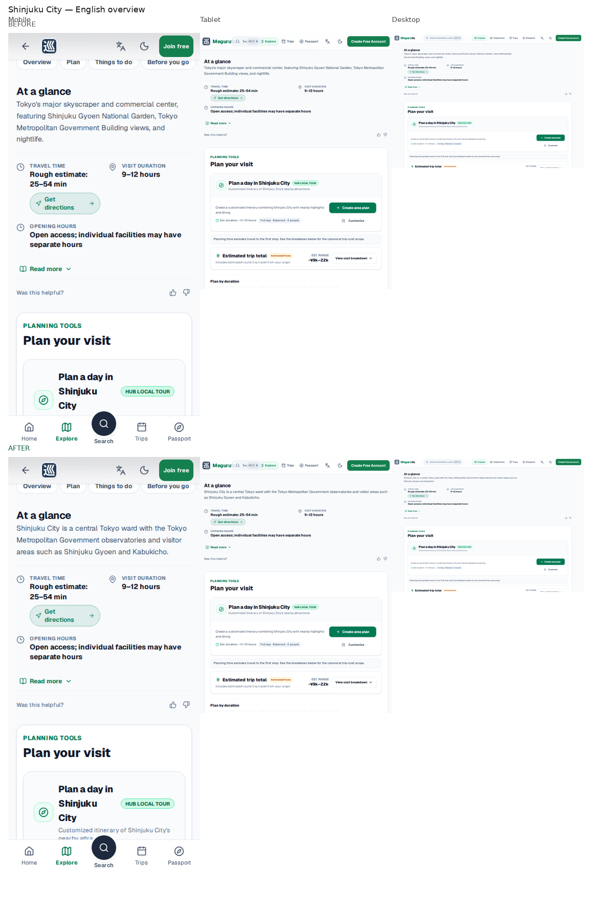
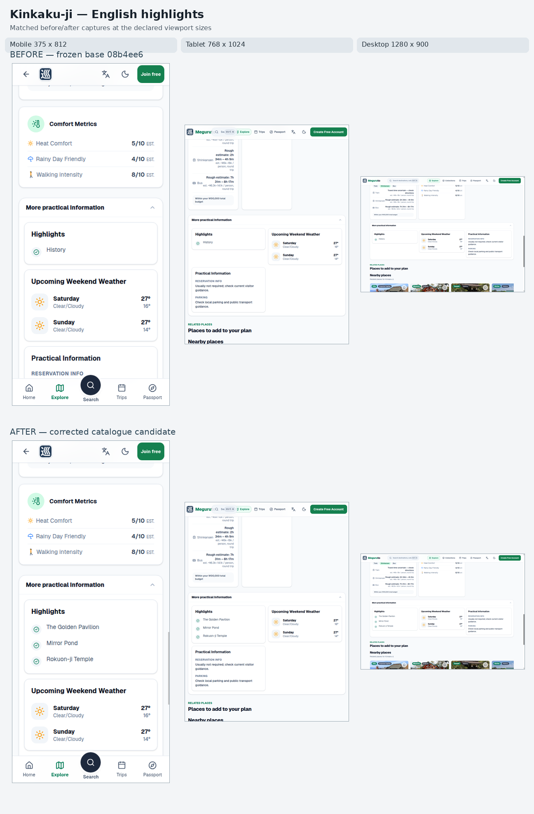
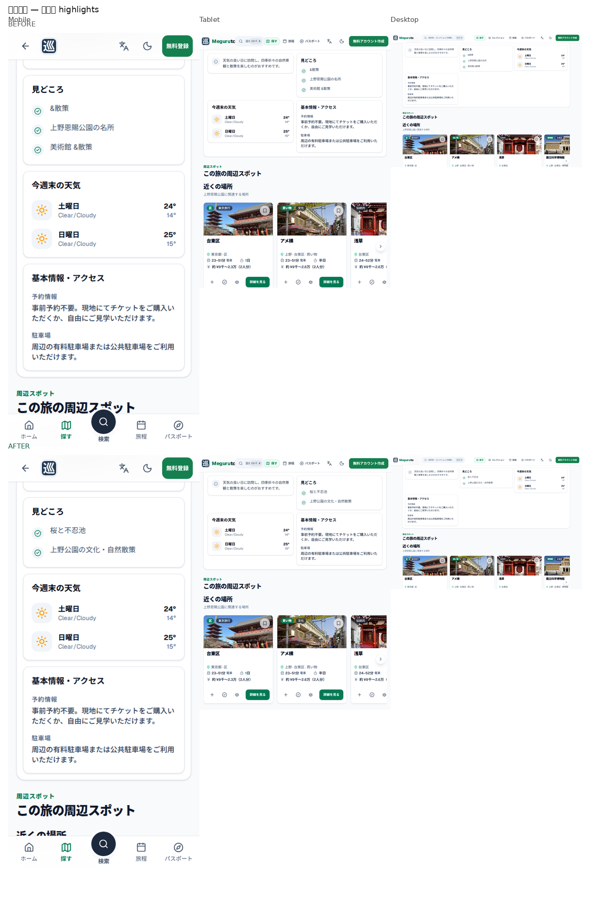
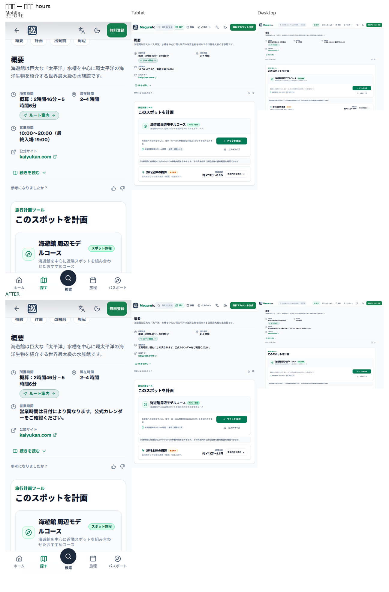
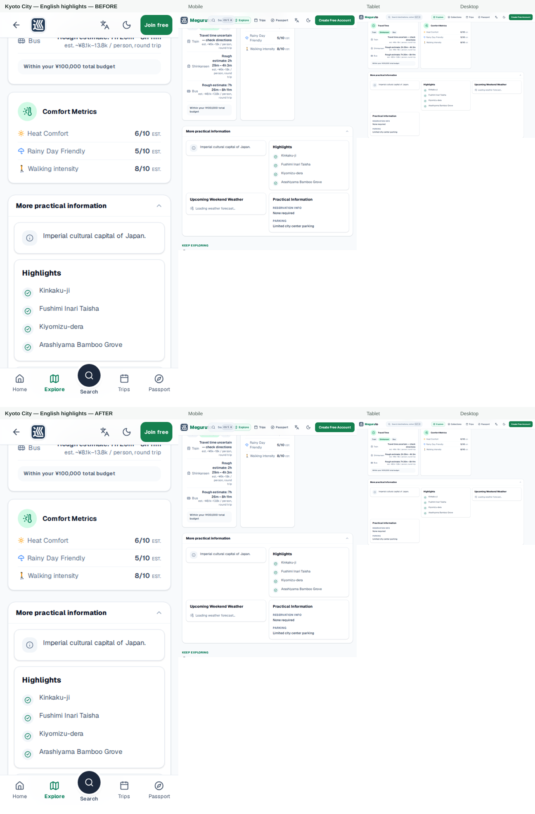
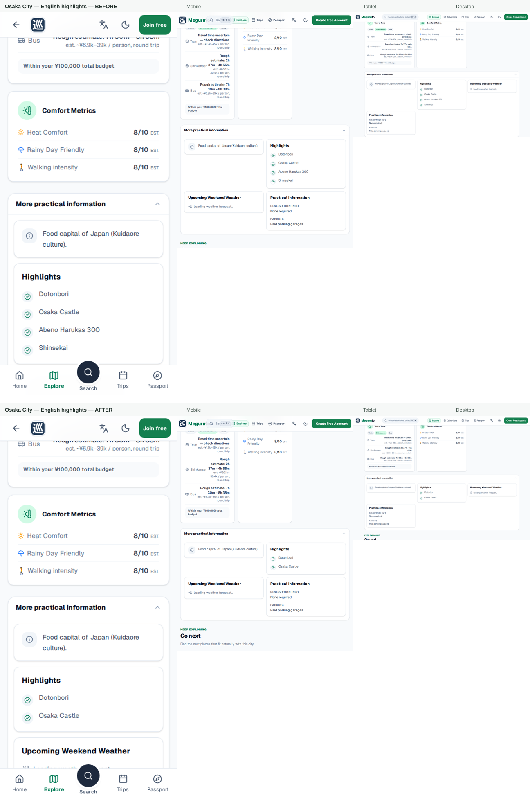
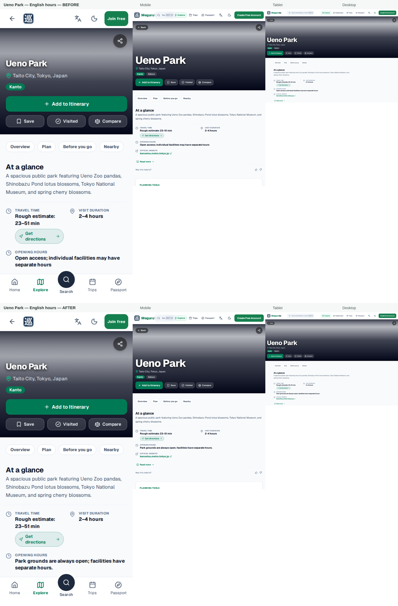
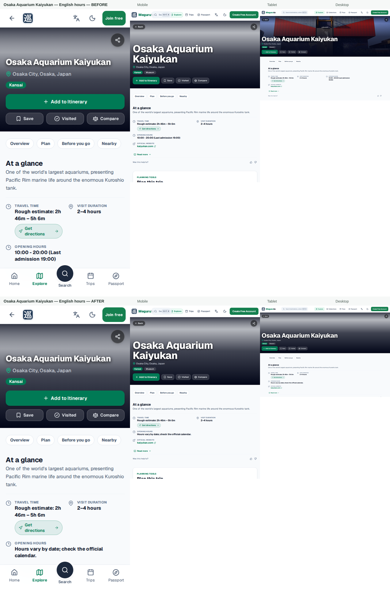

# KAI-306: 20-Destination Sample Audit

Checked: 2026-10-07 · Base: `08b4ee6dca318f0738cf95d3f40caceee412eefd`

## Result

- Public-fact gate: **8 PASS / 12 FAIL** after review (baseline: 2 PASS / 18 FAIL).
- Canonical rows changed: **7 / 20**; field paths changed: **46**.
- Population: **1130** records, **1130** unique; 1129 visible / 1 hidden.

**Gate definition:** PASS means reviewed public identity/kind, core descriptions/highlights, admission interpretation and opening-hours assertions have no known contradiction after repair; explicit unavailable/unknown values pass only when not presented as free, zero, or a verified specific value. This does not certify full planning readiness, image content/licensing, exact coordinates, or route accuracy.
**Outcome adjudication:** PASS/FAIL labels are manually adjudicated row by row against cited source observations and the stated gate. The audit script replays the frozen base-to-candidate edits and checks source references, counts, hashes, and report freshness; it does not re-fetch source pages or mechanically recompute those judgments.

This is not a full planning-readiness pass. See the separate evidence states below; unknown values remain unknown.

## Planning and source coverage

- KAI-87 sample states: budget {"unknown-critical":15,"partial":5}; seasonality {"unknown":14,"derived":4,"verified":2}; logistics {"partial":13,"complete":7}; route evidence {"derived":20}.
- KAI-87 copy/provenance states: content {"complete":19,"partial":1}; provenance {"verified":19,"unknown":1}. The remaining content-partial row is hakone-open-air-museum.
- Admission audit: incomplete estimates 54 vs 54 at base; current admission states across the full catalogue {"not_applicable":771,"verified_paid":238,"variable_price":54,"verified_free":38,"unavailable":29}. KAI-219 prose conflicts: 0.
- KAI-203: 1130 generated detail files synchronized; 0 structural errors; the sample’s empty English-highlight overrides fell from 4 to 2.
- KAI-257: 0 top-sight/geographic relationship defects in its full-catalogue audit.
- Images: 20 distinct hero URLs / 20 destinations; 17 have metadata and 3 lack it. Visual subject and license-page verification were not performed (0 / 0).
- Coordinates: 20 records contain numeric coordinates; exact map placement was not independently re-geocoded (0).
- Model derivation: no generated model changes; `npm run check:destination-models` passes.
- Full planning-readiness gate: **FAIL**; one rendered detail claim remains unsupported (see local page probe).
- Source collection was one-time manual review. Robots/terms were not systematically assessed for all pages; this report authorizes no recurring collection.

## Local detail-page probe

These unauthenticated local renders are product-page observations, not production/provider checks.

- `shinjuku-city` (en): **PASS**. Observed values: description: “Tokyo’s major skyscraper and commercial center, featuring Shinjuku Gyoen National Garden, Tokyo Metropolitan Government Building views, and nightlife.” → “Shinjuku City is a central Tokyo ward with the Tokyo Metropolitan Government observatories and visitor areas such as Shinjuku Gyoen and Kabukicho.”; opening hours: “Open access; individual facilities may have separate hours” → “Open access; individual facilities may have separate hours”. The city hub uses shared open-area guidance in both versions; destination-specific businessHours are not displayed as a ward-wide schedule.
  Review path: [src/shared/services/recommendation/OpeningHoursPolicy.ts](../../src/shared/services/recommendation/OpeningHoursPolicy.ts).
- `kinkaku-ji` (en): **PASS**. Observed values: highlights: ["History"] → ["The Golden Pavilion","Mirror Pond","Rokuon-ji Temple"]. All revised highlights are visible in the expanded details card and match the official operator evidence.
- `ueno-park` (ja): **PASS**. Observed values: highlights: ["上野恩賜公園の名所","美術館 &散策"] → ["桜と不忍池","上野公園の文化・自然散策"]. The revised Japanese highlights are visible in the expanded details card and match the official park evidence.
- `osaka-aquarium-kaiyukan` (ja): **PASS**. Observed values: opening hours: “10:00〜20:00（最終入場 19:00）” → “営業時間は日付により異なります。公式カレンダーをご確認ください。”. Japanese detail displays date-specific calendar guidance; the English schedule is audited separately.
- `kyoto-city` (ja): **FAIL**. Observed values: highlights: ["清水寺・金閣寺","祇園と町家","嵐山"] → ["清水寺・金閣寺","祇園と町家","嵐山"]. The Japanese page is overridden by EDITORIAL_PILOT and does not render the revised canonical content.ja.highlights.
- `hakone-open-air-museum` (en): **FAIL**. Observed values: visible budget claim: “Within your ¥100,000 total budget” (unknown-critical). The detail page asserts the trip fits the total budget while required budget evidence is unknown-critical.
- `kyoto-city` (en): **PASS**. Observed values: highlights: [] → ["Kinkaku-ji","Fushimi Inari Taisha","Kiyomizu-dera","Arashiyama Bamboo Grove"]. The expanded English practical-information section now renders the four source-backed highlights.
- `osaka-city` (en): **PASS**. Observed values: highlights: [] → ["Dotonbori","Osaka Castle"]. The expanded English practical-information section now renders the two source-backed highlights.
- `ueno-park` (en): **PASS**. Observed values: opening hours: “Open access; individual facilities may have separate hours” → “Park grounds are always open; facilities have separate hours.”; opening-hours status: “unverified” → “verified”. The official source states 常時開園; current source metadata supports the park-hours claim and removes the Not yet verified warning.
- `osaka-aquarium-kaiyukan` (en): **PASS**. Observed values: opening hours: “10:00 - 20:00 (Last admission 19:00)” → “Hours vary by date; check the official calendar.”. English detail replaces fixed daily hours with date-specific official-calendar guidance.
- Matched screenshots: 48 across shinjuku-city/en/overview, kinkaku-ji/en/highlights, ueno-park/ja/highlights, osaka-aquarium-kaiyukan/ja/overview, kyoto-city/en/highlights, osaka-city/en/highlights, ueno-park/en/opening-hours, osaka-aquarium-kaiyukan/en/opening-hours at 375x812, 768x1024, 1280x900. Inspected all four refreshed English sheets across mobile/tablet/desktop: updated highlights and hours are visible with no obvious clipping or overflow. The Ueno after-state no longer shows the unverified warning. The previously approved English/Japanese sheets remain unchanged. Human approval: **pending user review**. Sheets are included in the worktree pending user approval.

## Per-destination results

### Shinjuku City / shinjuku-city

- Result: **FAIL → PASS** for the defined public-fact gate.
- Kind: `ward`; admission: `not_applicable`.
- Planner signals: budget `unknown-critical`, seasonality `unknown`, logistics `partial`, route evidence `derived`, content `complete`, provenance `verified`.
- Coordinates: numeric point present; not georeferenced. Image: URL present; metadata missing; visual/source-page check not performed.
- Findings: no unresolved contradiction remains in the reviewed public-fact fields.
- Fix: [canonical catalogue](../../src/shared/data/destinations-index.json) · [generated detail](../../public/data/destinations/shinjuku-city.json).
- Sources: [S01](https://www.foreign.city.shinjuku.lg.jp/en/introduction/), [S02](https://www.gotokyo.org/en/destinations/western-tokyo/shinjuku/index.html).

### Kyoto City / kyoto-city

- Result: **FAIL → FAIL** for the defined public-fact gate.
- Kind: `city`; admission: `not_applicable`.
- Planner signals: budget `partial`, seasonality `unknown`, logistics `complete`, route evidence `derived`, content `complete`, provenance `verified`.
- Coordinates: numeric point present; not georeferenced. Image: URL present; metadata present; visual/source-page check not performed.
- Findings/remediation: The Japanese highlights remain overridden by EDITORIAL_PILOT and do not display the revised canonical list.
- Unresolved FAIL checks: The Japanese highlights remain overridden by EDITORIAL_PILOT and do not display the revised canonical list.
- Fix: [canonical catalogue](../../src/shared/data/destinations-index.json) · [generated detail](../../public/data/destinations/kyoto-city.json).
- Sources: [S03](https://kyoto.travel/en/discover/), [S15](https://kyoto.travel/en/destinations/fushimi-inaritaisha-shrine/), [S16](https://www.shokoku-ji.jp/en/kinkakuji/access/), [S17](https://www.kiyomizudera.or.jp/access.php#worship), [S19](https://nijo-jocastle.city.kyoto.lg.jp/guide/annai/?lang=en), [S20](https://kyoto.travel/en/areas/saga-arashiyama/).

### Osaka City / osaka-city

- Result: **FAIL → PASS** for the defined public-fact gate.
- Kind: `city`; admission: `not_applicable`.
- Planner signals: budget `partial`, seasonality `unknown`, logistics `complete`, route evidence `derived`, content `complete`, provenance `verified`.
- Coordinates: numeric point present; not georeferenced. Image: URL present; metadata present; visual/source-page check not performed.
- Findings: no unresolved contradiction remains in the reviewed public-fact fields.
- Fix: [canonical catalogue](../../src/shared/data/destinations-index.json) · [generated detail](../../public/data/destinations/osaka-city.json).
- Sources: [S04](https://osaka-info.jp/en/), [S21](https://www.osakacastle.net/guide/), [S23](https://osaka-info.jp/en/spot/dotonbori/).

### Hakone Town / hakone-town

- Result: **FAIL → FAIL** for the defined public-fact gate.
- Kind: `town`; admission: `not_applicable`.
- Planner signals: budget `unknown-critical`, seasonality `unknown`, logistics `complete`, route evidence `derived`, content `complete`, provenance `verified`.
- Coordinates: numeric point present; not georeferenced. Image: URL present; metadata missing; visual/source-page check not performed.
- Findings/remediation: Town-wide 24-hour access and malformed Japanese highlights remain; official sources reviewed do not establish a town-wide schedule.
- Unresolved FAIL checks: Town-wide 24-hour access and malformed Japanese highlights remain; official sources reviewed do not establish a town-wide schedule.
- Fix: [canonical catalogue](../../src/shared/data/destinations-index.json) · [generated detail](../../public/data/destinations/hakone-town.json).
- Sources: [S05](https://www.hakonenavi.jp/international/en/destination), [S06](https://www.town.hakone.kanagawa.jp/www/index.html), [S24](https://www.hakone-oam.or.jp/en/info/).

### Karuizawa Town / karuizawa-town

- Result: **FAIL → PASS** for the defined public-fact gate.
- Kind: `town`; admission: `not_applicable`.
- Planner signals: budget `unknown-critical`, seasonality `unknown`, logistics `partial`, route evidence `derived`, content `complete`, provenance `unknown`.
- Coordinates: numeric point present; not georeferenced. Image: URL present; metadata present; visual/source-page check not performed.
- Findings: no unresolved contradiction remains in the reviewed public-fact fields.
- Fix: [canonical catalogue](../../src/shared/data/destinations-index.json) · [generated detail](../../public/data/destinations/karuizawa-town.json).
- Sources: [S07](https://www.town.karuizawa.lg.jp/page/1194.html).

### Tokyo Tower / tokyo-tower-minato

- Result: **FAIL → FAIL** for the defined public-fact gate.
- Kind: `tower`; admission: `verified_paid`.
- Planner signals: budget `partial`, seasonality `derived`, logistics `complete`, route evidence `derived`, content `complete`, provenance `verified`.
- Coordinates: numeric point present; not georeferenced. Image: URL present; metadata present; visual/source-page check not performed.
- Findings/remediation: Canonical Main Deck schedule still differs from the operator listing (09:00–23:00, last entry 22:30); identity/copy needs follow-up.
- Unresolved FAIL checks: Canonical Main Deck schedule still differs from the operator listing (09:00–23:00, last entry 22:30); identity/copy needs follow-up.
- Fix: [canonical catalogue](../../src/shared/data/destinations-index.json) · [generated detail](../../public/data/destinations/tokyo-tower-minato.json).
- Sources: [S08](https://www.tokyotower.co.jp/fee/).

### Tokyo Skytree / tokyo-skytree-sumida

- Result: **FAIL → FAIL** for the defined public-fact gate.
- Kind: `tower`; admission: `variable_price`.
- Planner signals: budget `unknown-critical`, seasonality `derived`, logistics `complete`, route evidence `derived`, content `complete`, provenance `verified`.
- Coordinates: numeric point present; not georeferenced. Image: URL present; metadata present; visual/source-page check not performed.
- Findings/remediation: Canonical fixed hours do not match the operator’s date-specific calendar (10:00–22:00, last entry 21:00 on 2026-10-05); copy needs follow-up.
- Unresolved FAIL checks: Canonical fixed hours do not match the operator’s date-specific calendar (10:00–22:00, last entry 21:00 on 2026-10-05); copy needs follow-up.
- Fix: [canonical catalogue](../../src/shared/data/destinations-index.json) · [generated detail](../../public/data/destinations/tokyo-skytree-sumida.json).
- Sources: [S09](https://en.tokyo-skytree.jp/open-hours/day_hours/), [S10](https://en.tokyo-skytree.jp/ticket/).

### Meiji Jingu / meiji-jingu

- Result: **FAIL → FAIL** for the defined public-fact gate.
- Kind: `shrine`; admission: `not_applicable`.
- Planner signals: budget `unknown-critical`, seasonality `verified`, logistics `complete`, route evidence `derived`, content `complete`, provenance `verified`.
- Coordinates: numeric point present; not georeferenced. Image: URL present; metadata present; visual/source-page check not performed.
- Findings/remediation: The canonical 24-hour claim conflicts with the shrine’s seasonal sunrise-to-sunset grounds schedule.
- Unresolved FAIL checks: The canonical 24-hour claim conflicts with the shrine’s seasonal sunrise-to-sunset grounds schedule.
- Fix: [canonical catalogue](../../src/shared/data/destinations-index.json) · [generated detail](../../public/data/destinations/meiji-jingu.json).
- Sources: [S11](https://www.meijijingu.or.jp/en/visit/).

### Shibuya Crossing and Hachiko / shibuya-crossing-hachiko

- Result: **FAIL → FAIL** for the defined public-fact gate.
- Kind: `district`; admission: `not_applicable`.
- Planner signals: budget `unknown-critical`, seasonality `unknown`, logistics `partial`, route evidence `derived`, content `complete`, provenance `verified`.
- Coordinates: numeric point present; not georeferenced. Image: URL present; metadata present; visual/source-page check not performed.
- Findings/remediation: The “world’s busiest” claim and 09:00–17:00 schedule were not established by reviewed official sources.
- Unresolved FAIL checks: The “world’s busiest” claim and 09:00–17:00 schedule were not established by reviewed official sources.
- Fix: [canonical catalogue](../../src/shared/data/destinations-index.json) · [generated detail](../../public/data/destinations/shibuya-crossing-hachiko.json).
- Sources: [S12](https://www.gotokyo.org/en/destinations/western-tokyo/shibuya/index.html), [S13](https://www.gotokyo.org/en/spot/86/index.html).

### Ueno Park / ueno-park

- Result: **FAIL → PASS** for the defined public-fact gate.
- Kind: `park`; admission: `not_applicable`.
- Planner signals: budget `partial`, seasonality `unknown`, logistics `complete`, route evidence `derived`, content `complete`, provenance `verified`.
- Coordinates: numeric point present; not georeferenced. Image: URL present; metadata present; visual/source-page check not performed.
- Findings: no unresolved contradiction remains in the reviewed public-fact fields.
- Fix: [canonical catalogue](../../src/shared/data/destinations-index.json) · [generated detail](../../public/data/destinations/ueno-park.json).
- Sources: [S14](https://www.tokyo-park.or.jp/park/ueno/index.html).

### Fushimi Inari Taisha / fushimi-inari-taisha

- Result: **FAIL → FAIL** for the defined public-fact gate.
- Kind: `shrine`; admission: `unavailable`.
- Planner signals: budget `unknown-critical`, seasonality `unknown`, logistics `partial`, route evidence `derived`, content `complete`, provenance `verified`.
- Coordinates: numeric point present; not georeferenced. Image: URL present; metadata present; visual/source-page check not performed.
- Findings/remediation: Canonical kind remains museum although the Kyoto guide identifies a shrine; 24-hour access and general admission were not established.
- Unresolved FAIL checks: Canonical kind remains museum although the Kyoto guide identifies a shrine; 24-hour access and general admission were not established.
- Fix: [canonical catalogue](../../src/shared/data/destinations-index.json) · [generated detail](../../public/data/destinations/fushimi-inari-taisha.json).
- Sources: [S15](https://kyoto.travel/en/destinations/fushimi-inaritaisha-shrine/).

### Kinkaku-ji / kinkaku-ji

- Result: **FAIL → PASS** for the defined public-fact gate.
- Kind: `temple`; admission: `verified_paid`.
- Planner signals: budget `unknown-critical`, seasonality `unknown`, logistics `partial`, route evidence `derived`, content `complete`, provenance `verified`.
- Coordinates: numeric point present; not georeferenced. Image: URL present; metadata present; visual/source-page check not performed.
- Findings: no unresolved contradiction remains in the reviewed public-fact fields.
- Fix: [canonical catalogue](../../src/shared/data/destinations-index.json) · [generated detail](../../public/data/destinations/kinkaku-ji.json).
- Sources: [S16](https://www.shokoku-ji.jp/en/kinkakuji/access/).

### Kiyomizu-dera Temple / kiyomizu-dera

- Result: **FAIL → FAIL** for the defined public-fact gate.
- Kind: `temple`; admission: `unavailable`.
- Planner signals: budget `unknown-critical`, seasonality `verified`, logistics `partial`, route evidence `derived`, content `complete`, provenance `verified`.
- Coordinates: numeric point present; not georeferenced. Image: URL present; metadata present; visual/source-page check not performed.
- Findings/remediation: The canonical ¥500 general-admission amount could not be confirmed on the official visitor/FAQ pages reviewed.
- Unresolved FAIL checks: The canonical ¥500 general-admission amount could not be confirmed on the official visitor/FAQ pages reviewed.
- Fix: [canonical catalogue](../../src/shared/data/destinations-index.json) · [generated detail](../../public/data/destinations/kiyomizu-dera.json).
- Sources: [S17](https://www.kiyomizudera.or.jp/access.php#worship), [S18](https://www.kiyomizudera.or.jp/faq.php).

### Nijo Castle (Kyoto) / nijo-castle-kyoto

- Result: **FAIL → FAIL** for the defined public-fact gate.
- Kind: `castle`; admission: `verified_paid`.
- Planner signals: budget `unknown-critical`, seasonality `unknown`, logistics `partial`, route evidence `derived`, content `complete`, provenance `verified`.
- Coordinates: numeric point present; not georeferenced. Image: URL present; metadata present; visual/source-page check not performed.
- Findings/remediation: Source-backed Ninomaru Palace highlights were not applied because generated editorial outputs are kept at their frozen base; English highlight coverage remains incomplete.
- Unresolved FAIL checks: Source-backed Ninomaru Palace highlights were not applied because generated editorial outputs are kept at their frozen base; English highlight coverage remains incomplete.
- Fix: [canonical catalogue](../../src/shared/data/destinations-index.json) · [generated detail](../../public/data/destinations/nijo-castle-kyoto.json).
- Sources: [S19](https://nijo-jocastle.city.kyoto.lg.jp/guide/annai/?lang=en).

### Arashiyama Bamboo Grove and Togetsukyo Bridge / arashiyama-bamboo-togetsukyo

- Result: **PASS → PASS** for the defined public-fact gate.
- Kind: `nature`; admission: `not_applicable`.
- Planner signals: budget `unknown-critical`, seasonality `unknown`, logistics `partial`, route evidence `derived`, content `complete`, provenance `verified`.
- Coordinates: numeric point present; not georeferenced. Image: URL present; metadata present; visual/source-page check not performed.
- Findings: no unresolved contradiction remains in the reviewed public-fact fields.
- Fix: not required.
- Sources: [S20](https://kyoto.travel/en/areas/saga-arashiyama/).

### Osaka Castle (Osaka-jo) / osaka-castle

- Result: **FAIL → FAIL** for the defined public-fact gate.
- Kind: `castle`; admission: `verified_paid`.
- Planner signals: budget `unknown-critical`, seasonality `derived`, logistics `complete`, route evidence `derived`, content `complete`, provenance `verified`.
- Coordinates: numeric point present; not georeferenced. Image: URL present; metadata missing; visual/source-page check not performed.
- Findings/remediation: Generic/placeholder highlights remain; the paid Main Tower fee/hours do not describe the whole castle grounds.
- Unresolved FAIL checks: Generic/placeholder highlights remain; the paid Main Tower fee/hours do not describe the whole castle grounds.
- Fix: [canonical catalogue](../../src/shared/data/destinations-index.json) · [generated detail](../../public/data/destinations/osaka-castle.json).
- Sources: [S21](https://www.osakacastle.net/guide/).

### Osaka Aquarium Kaiyukan / osaka-aquarium-kaiyukan

- Result: **FAIL → PASS** for the defined public-fact gate.
- Kind: `aquarium`; admission: `variable_price`.
- Planner signals: budget `unknown-critical`, seasonality `unknown`, logistics `partial`, route evidence `derived`, content `complete`, provenance `verified`.
- Coordinates: numeric point present; not georeferenced. Image: URL present; metadata present; visual/source-page check not performed.
- Findings: no unresolved contradiction remains in the reviewed public-fact fields.
- Fix: [canonical catalogue](../../src/shared/data/destinations-index.json) · [generated detail](../../public/data/destinations/osaka-aquarium-kaiyukan.json).
- Sources: [S22](https://www.kaiyukan.com/info/ticket/kaiyukan/).

### Dotonbori / dotonbori

- Result: **FAIL → FAIL** for the defined public-fact gate.
- Kind: `district`; admission: `not_applicable`.
- Planner signals: budget `unknown-critical`, seasonality `unknown`, logistics `partial`, route evidence `derived`, content `complete`, provenance `verified`.
- Coordinates: numeric point present; not georeferenced. Image: URL present; metadata present; visual/source-page check not performed.
- Findings/remediation: Canonical kind remains museum although the official guide identifies a shopping/entertainment district; no district-wide schedule was established.
- Unresolved FAIL checks: Canonical kind remains museum although the official guide identifies a shopping/entertainment district; no district-wide schedule was established.
- Fix: [canonical catalogue](../../src/shared/data/destinations-index.json) · [generated detail](../../public/data/destinations/dotonbori.json).
- Sources: [S23](https://osaka-info.jp/en/spot/dotonbori/).

### Hakone Open-Air Museum / hakone-open-air-museum

- Result: **FAIL → FAIL** for the defined public-fact gate.
- Kind: `museum`; admission: `variable_price`.
- Planner signals: budget `unknown-critical`, seasonality `derived`, logistics `partial`, route evidence `derived`, content `partial`, provenance `verified`.
- Coordinates: numeric point present; not georeferenced. Image: URL present; metadata present; visual/source-page check not performed.
- Findings/remediation: The canonical “120 works” total is unsupported; official museum pages distinguish 2,000+ collection works from about 100 outdoor masterpieces.
- Unresolved FAIL checks: The canonical “120 works” total is unsupported; official museum pages distinguish 2,000+ collection works from about 100 outdoor masterpieces.
- Fix: [canonical catalogue](../../src/shared/data/destinations-index.json) · [generated detail](../../public/data/destinations/hakone-open-air-museum.json).
- Sources: [S24](https://www.hakone-oam.or.jp/en/info/), [S25](https://www.hakone-oam.or.jp/en/permanentexhibits/).

### Kyu-Karuizawa Ginza / kyu-karuizawa-ginza

- Result: **PASS → PASS** for the defined public-fact gate.
- Kind: `street`; admission: `not_applicable`.
- Planner signals: budget `unknown-critical`, seasonality `unknown`, logistics `partial`, route evidence `derived`, content `complete`, provenance `verified`.
- Coordinates: numeric point present; not georeferenced. Image: URL present; metadata present; visual/source-page check not performed.
- Findings: no unresolved contradiction remains in the reviewed public-fact fields.
- Fix: not required.
- Sources: [S26](https://karuizawa-kankokyokai.jp/spot/30092/).

## Deferred evidence / explicit limitations

- 15 sample budgets remain unknown-critical and 5 remain partial; they were not replaced with zero or a guessed amount.
- 14 seasonality profiles remain unknown; no generic all-year values were added.
- 3 image-metadata records remain missing: shinjuku-city, hakone-town, osaka-castle. All 20 image subjects/usage permissions remain visually unverified.
- One destination still has partial content integrity (hakone-open-air-museum); one source-provenance record remains unknown (karuizawa-town).
- Exact coordinate placement, real-page travel-time behavior, itinerary feasibility and destination-specific image matching were not tested in a browser in this data-only PR.
- A source page that restricts reuse was excluded from the edited copy; see the `sourceAccess` record in the JSON manifest.

## Machine-readable evidence

The JSON beside this report contains the exact 20-ID list, source observations, access limitations, before/after field values, planner states, and fix paths. Reproduce/verify it with `npm run audit:kai-306`.
